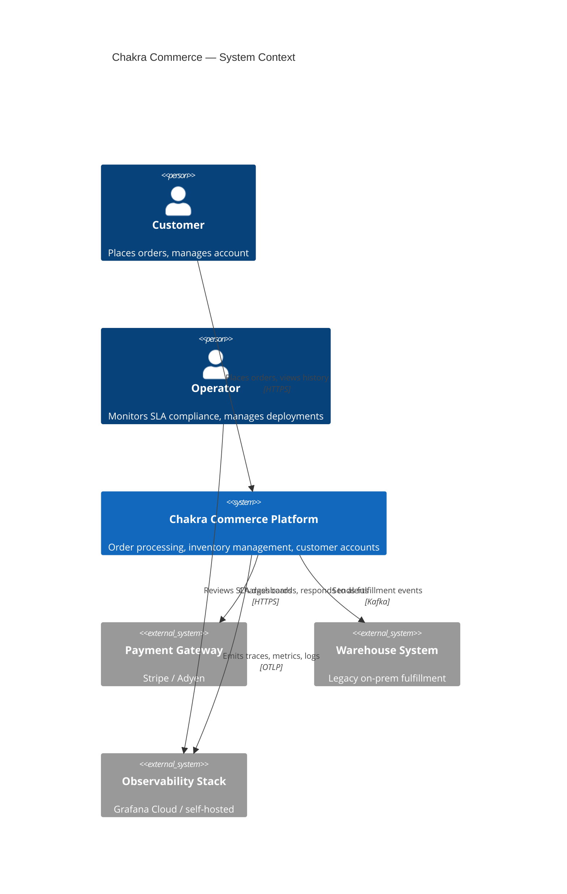

# chakraview-enterprise-modernization

> A reference architecture for modernizing enterprise monoliths to cloud-native microservices — where humans provide domain knowledge and AI agents do the implementation.

---

## What This Is

This repo documents the modernization of **Chakra Commerce**, a mid-size e-commerce platform, from a Java EE monolith to a cloud-native microservices architecture on Kubernetes.

The architectural thesis is forward-looking: **humans are the domain experts, AI agents are the implementers**. Engineers author contracts — SLAs, business invariants, event schemas, bounded context maps — and agents build from them. Every file in this repo is either a human-authored contract or an agent-built artifact derived from one. The line between the two is explicit by design.

SLA measurement is not an afterthought. It is woven into the architecture from the first contract file to the last Prometheus alert.

---

## Architecture at a Glance



---

## The Modernization Journey

| Phase | What Changes | Key Risk | Status |
|---|---|---|---|
| 1 — Facade Layer | Kong gateway deployed in front of monolith | Routing misconfiguration | Done |
| 2 — Extract Customers | Customers service live; traffic routed by path prefix | Data sync lag | Done |
| 3 — Extract Inventory | Inventory service live; CDC pipeline replaces shared DB reads | Dual-write consistency | In progress |
| 4 — Extract Orders | Orders service live; event sourcing adopted | Saga coordination complexity | Planned |
| 5 — Decommission | Monolith retired; all traffic on new services | Rollback path gone | Planned |

Full strategy: [`docs/migration/strategy.md`](docs/migration/strategy.md)

---

## Key Architectural Decisions

| ADR | Decision | Rationale |
|---|---|---|
| [ADR-0001](docs/adrs/ADR-0001-contract-first-development.md) | Contract-first development | Humans define what; agents build how |
| [ADR-0002](docs/adrs/ADR-0002-slo-as-code.md) | SLOs as versioned YAML | SLA targets are code, not wiki pages |
| [ADR-0003](docs/adrs/ADR-0003-strangler-fig-migration.md) | Strangler fig migration | No big-bang rewrite; each phase is independently reversible |
| [ADR-0006](docs/adrs/ADR-0006-event-sourcing-orders.md) | Event sourcing for Orders | Full audit trail; saga compensation requires event replay |

Full ADR index: [`docs/adrs/README.md`](docs/adrs/README.md)

---

## Repository Map

```
contracts/          Human-authored source of truth: SLAs, invariants, event schemas
docs/
  architecture/     C4 diagrams, principles, human-AI model explanation
  adrs/             Architecture Decision Records (MADR format)
  ddd/              Bounded contexts, ubiquitous language, domain models
  migration/        Strangler fig phasing, data migration patterns, rollback playbooks
  runbooks/         SLA breach response, service degradation, Kafka lag recovery
ai-agents/
  tasks/agent/      LLM task specs: implement services, write ADRs, write runbooks
  tasks/script/     Deterministic script specs: generate alerts, Helm stubs, CI pipelines
  context/          Coding standards, infra conventions, observability requirements
tooling/            Scripts that transform structured inputs into artifacts
api/
  openapi/          OpenAPI 3.1 contracts (API-first; defined before implementation)
  asyncapi/         AsyncAPI 3.0 event contracts (Kafka topics)
services/           TypeScript service skeletons; each built from contracts/ by AI agents
infrastructure/     Terraform modules, Helm charts, Kubernetes manifests
observability/      SLO definitions, burn rate alerts, Grafana dashboards, OTEL pipeline
```

---

## How to Navigate This Repo

| I want to understand... | Go to... |
|---|---|
| What SLAs this system must meet | [`contracts/slas/`](contracts/slas/) |
| How SLAs are measured at runtime | [`observability/slos/`](observability/slos/) + [`observability/alerts/`](observability/alerts/) |
| The business rules that can never be violated | [`contracts/domain-invariants/`](contracts/domain-invariants/) |
| Why key architecture decisions were made | [`docs/adrs/`](docs/adrs/) |
| How the monolith is being dismantled | [`docs/migration/strategy.md`](docs/migration/strategy.md) |
| How AI agents are used in this workflow | [`docs/architecture/human-ai-model.md`](docs/architecture/human-ai-model.md) |
| What an agent task looks like | [`ai-agents/tasks/agent/`](ai-agents/tasks/agent/) |
| What can be scripted vs. needs an agent | [`ai-agents/README.md`](ai-agents/README.md) |
| How services are structured | [`services/README.md`](services/README.md) |
| How to respond to an SLA breach | [`docs/runbooks/sla-breach-response.md`](docs/runbooks/sla-breach-response.md) |

---

## Technology Stack

| Concern | Choice |
|---|---|
| Services | TypeScript / Node.js (Fastify) |
| Event store | EventStoreDB (Orders); PostgreSQL (Inventory, Customers) |
| Message bus | Apache Kafka (Amazon MSK) |
| Read cache | Redis (Inventory CQRS projection) |
| API gateway | Kong (strangler fig facade) |
| Container platform | Kubernetes (Amazon EKS) |
| Infrastructure as Code | Terraform (modules) + Helm (charts) + ArgoCD (GitOps) |
| Observability | OpenTelemetry → Grafana (Tempo / Loki / Mimir) |
| Secrets | AWS Secrets Manager + External Secrets Operator |
| TLS | cert-manager + Istio mTLS |

---

## How This Was Built

This project was built using the [Chakraview AI Dev Model](https://github.com/naren-chakraview/chakraview-ai-dev-model) — a 6-persona workflow where humans author contracts and agents implement from them.

[How This Was Built →](docs/how-this-was-built.md)
