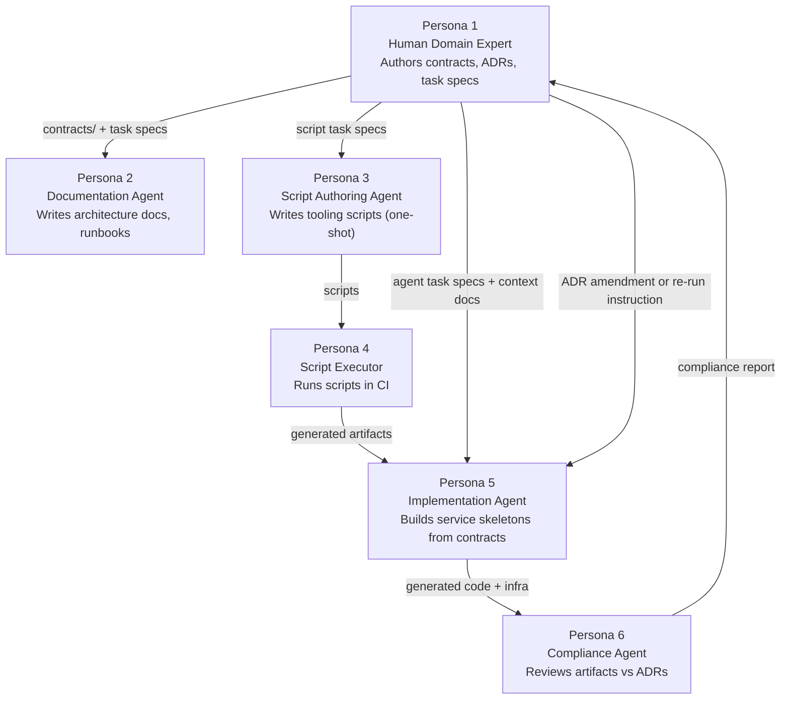

# AI Agent Model

The central claim of this architecture: senior engineers are most valuable when they are defining correctness, not implementing it. AI agents are most useful when given precise, unambiguous inputs and a clear definition of done.

This repo operationalizes that claim. Engineers author **contracts** — SLAs, invariants, event schemas, ADRs. Agents receive task specs that enumerate exactly which files to read and exactly what to produce.

---

## The Six Personas

| # | Persona | Type | Primary output |
|---|---|---|---|
| 1 | **Human Domain Expert** | Human | `contracts/`, `docs/adrs/`, `docs/ddd/`, `ai-agents/tasks/` |
| 2 | **Documentation Agent** | LLM | Architecture docs, ADRs, runbooks, migration phase docs |
| 3 | **Script Authoring Agent** | LLM (one-shot) | Deterministic scripts in `tooling/` |
| 4 | **Script Executor** | Automation | CI output: alerts, Helm stubs, CI pipelines |
| 5 | **Service Implementation Agent** | LLM | Service skeletons in `services/*/src/` |
| 6 | **Architectural Compliance Agent** | LLM auditor | Compliance reports in `ai-agents/reviews/` |

Full persona definitions and the complete 7-phase workflow: [`docs/architecture/agent-personas.md`](../architecture/agent-personas.md)

---

## The Workflow

---

## Agent vs. Script: The Decision Rule

The workflow makes a hard distinction between tasks that require judgment and tasks that are deterministic transformations.

**Use an agent when:**

- The input is natural language (business rules, ADR rationale)
- The task requires synthesizing multiple inputs into a coherent whole
- A senior engineer would need to _think_ to produce the output
- Naming, tradeoffs, or idiomatic patterns must be resolved

**Use a script when:**

- The task is a structured input → structured output transformation
- The output is fully determined by the input (running twice gives identical results)
- The script can run on every CI push without human review

The meta-rule: **agents write the scripts**. An agent runs once to produce the script; the script runs forever. See [`ai-agents/README.md`](https://github.com/naren-chakraview/chakraview-enterprise-modernization/blob/main/ai-agents/README.md) for the full table.

---

## Task Spec Structure

A task spec is the interface between human intent and agent output. It must be self-contained, explicit about inputs, and acceptance-criteria-driven.

!!! example "Reference: Orders Service Implementation Task"
    [`ai-agents/tasks/agent/implement-orders-service.md`](https://github.com/naren-chakraview/chakraview-enterprise-modernization/blob/main/ai-agents/tasks/agent/implement-orders-service.md) specifies:

    - 9 input files the agent must read (contracts, DDD models, context docs)
    - 14 output files the agent must produce (domain, application, infrastructure, tests)
    - 6 implementation constraints (typed events via zod, OTEL bucket alignment, outbox pattern)
    - 5 acceptance criteria (all tests pass, type check passes, compliance review passes)

---

## Architectural Compliance Gate

After Phases 4 (infrastructure) and 5 (implementation), the Compliance Agent (Persona 6) runs a structured review against all ADRs and coding standards. The report classifies every deviation as **intentional** or **unintentional**:

- **Intentional**: A deliberate tradeoff the agent made that differs from an ADR. Requires a human to write or amend an ADR, then a second scoped compliance pass.
- **Unintentional**: Contradicts a spec the agent was given. The implementation agent re-runs with the compliance report as additional context.

The compliance checklist currently has **26 checks** across Phase 4 (infrastructure) and Phase 5 (implementation).

!!! example "Reference Implementation"
    [`ai-agents/tasks/agent/architectural-compliance-review.md`](https://github.com/naren-chakraview/chakraview-enterprise-modernization/blob/main/ai-agents/tasks/agent/architectural-compliance-review.md) — full checklist, classification rubric, and report format

---

## Context Documents

Every agent task spec references one or more context documents that define non-negotiable standards:

| Document | What it constrains |
|---|---|
| [`ai-agents/context/coding-standards.md`](https://github.com/naren-chakraview/chakraview-enterprise-modernization/blob/main/ai-agents/context/coding-standards.md) | TypeScript style, error handling, naming conventions |
| [`ai-agents/context/observability-requirements.md`](https://github.com/naren-chakraview/chakraview-enterprise-modernization/blob/main/ai-agents/context/observability-requirements.md) | Required metric names, histogram buckets, span names, log fields |

An agent that ignores these documents produces output that fails the compliance review.
