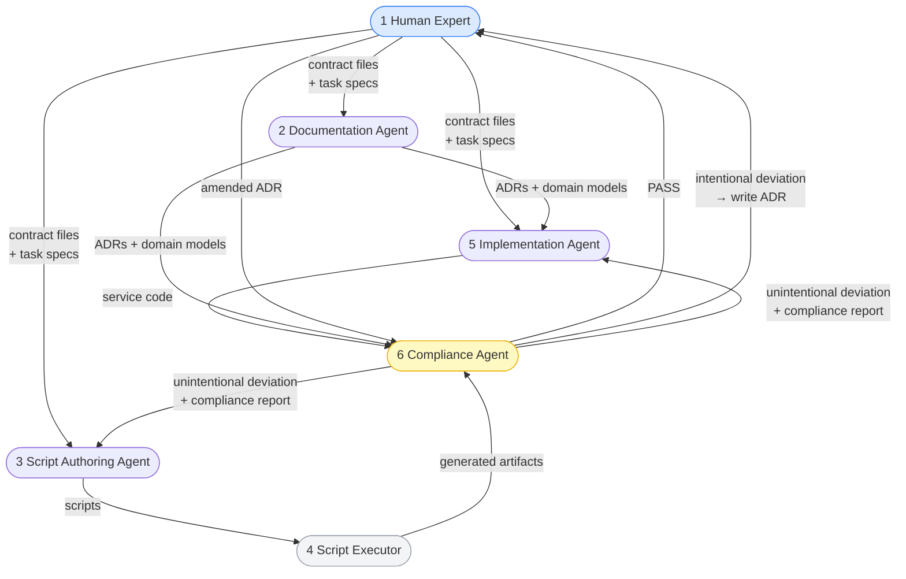

# Agent Personas

This document defines the six personas that participate in the Chakra Commerce development workflow. Every artifact in this repository was produced by one of these personas. The line between them is explicit and enforced.

---

## Overview

| # | Persona | Type | Primary output |
|---|---|---|---|
| 1 | Human Domain Expert | Human | `contracts/`, ADR stubs, task specs |
| 2 | Documentation Agent | LLM | ADRs, domain models, migration docs, runbooks |
| 3 | Script Authoring Agent | LLM (one-shot) | `tooling/*.py`, `tooling/*.sh` |
| 4 | Script Executor | Automation | Alerts, Helm charts, CI pipelines, validation reports |
| 5 | Service Implementation Agent | LLM | `services/*/src/`, domain tests |
| 6 | Architectural Compliance Agent | LLM (auditor) | `ai-agents/reviews/*-compliance-*.md` |

---

## Persona 1 — Human Domain Expert

**Type**: Human
**Accountable for**: Correctness. If a contract is wrong, every downstream artifact is wrong.

### What this persona authors

- `contracts/slas/` — SLA targets negotiated with stakeholders
- `contracts/domain-invariants/` — business rules the domain must never violate
- `contracts/event-schemas/` — canonical JSON Schemas for every domain event
- `tooling/service-manifest.yaml` — authoritative list of services, owners, resources
- `docs/adrs/` — decision context and rationale stubs (the *why*, not the full MADR)
- `docs/ddd/bounded-contexts.md`, `ubiquitous-language.md` — context boundaries and shared language
- `ai-agents/tasks/` — task specifications that instruct every other persona

### What this persona does not author

Code, infrastructure manifests, observability artifacts, full ADRs, runbooks, migration docs. Those are produced by agents from the contracts this persona writes.

### Review responsibility

This persona performs the final review gate after each agent phase. The review question is always the same: *does this artifact correctly express the contract?* Not: *is this good code?*

### Guardrails

`CODEOWNERS` maps `contracts/` to `@chakraview/senior-engineers`. No agent-initiated PR may modify a contract file.

---

## Persona 2 — Documentation Agent

**Type**: LLM
**Runs**: After contracts and context stubs exist; after architectural decisions are made

### What this persona produces

- Full ADRs in MADR format — rationale, consequences, alternatives considered
- `docs/ddd/*/domain-model.md` — aggregate structure, commands, invariant mapping, repository contract
- `docs/ddd/*/state-machine.md` — state transition diagrams from invariants
- `docs/migration/` — phase docs with risk assessment, dependency ordering, rollback procedures
- `docs/runbooks/` — one runbook per failure mode referenced in the SLA
- `api/openapi/*.yaml` — OpenAPI 3.1 contracts from domain models and route definitions
- `api/asyncapi/*.yaml` — AsyncAPI 3.0 event contracts from `contracts/event-schemas/`

### What distinguishes this persona

Its output is prose, structured argument, and narrative — not code. The quality of its output depends directly on the richness of the ADR context stubs and invariant docs provided by the Human Expert. A two-sentence ADR stub produces a shallow ADR. A five-paragraph stub that names the forces, the alternatives, and the tradeoffs produces a decision record worth reading.

### Input contract

Every Documentation Agent task spec in `ai-agents/tasks/agent/` must name:
- The human-authored stubs it reads
- The invariant docs and context docs that constrain its output
- The acceptance criteria (e.g., every ADR must reference at least one invariant; every runbook must reference a specific alert name)

---

## Persona 3 — Script Authoring Agent

**Type**: LLM (one-shot per script)
**Runs**: Once, when a new deterministic transformation task is identified

### What this persona produces

Deterministic transformation scripts in `tooling/`:
- `generate-prometheus-rules.py` — SLO YAML → PrometheusRule manifests
- `generate-helm-boilerplate.sh` — service manifest → Helm chart directory
- `generate-ci-workflow.sh` — service name + language → GitHub Actions YAML
- `generate-codeowners.py` — team-context map → CODEOWNERS
- `validate-contracts.sh` — repo state → pass/fail coverage report

### What distinguishes this persona

Its output is not a deliverable — it is the *next persona's input*. The agent runs exactly once per script. After the script is reviewed and merged, the agent is never re-invoked for that task. Only the script runs, forever.

This persona is the bridge between LLM reasoning and machine execution. It crystallizes judgment into repeatable automation.

### When to invoke this persona vs. Persona 5

If the task requires reading structured data and producing structured output through a deterministic algorithm: invoke this persona. If the task requires reading natural language (invariants, ADR rationale) and producing idiomatic code through synthesis: invoke Persona 5.

---

## Persona 4 — Script Executor

**Type**: Deterministic automation (no LLM)
**Runs**: In CI on every relevant push; manually on demand

### What this persona produces

- `observability/slos/*.yaml` — from `contracts/slas/` via `generate-prometheus-rules.py`
- `observability/alerts/*-burnrate.yaml` — from SLO YAML via `generate-prometheus-rules.py`
- `infrastructure/helm/charts/{service}/` — from service manifest via `generate-helm-boilerplate.sh`
- `.github/workflows/ci-{service}.yml` — from service manifest via `generate-ci-workflow.sh`
- `CODEOWNERS` — from team-context map via `generate-codeowners.py`
- Validation reports — from `validate-contracts.sh`

### What distinguishes this persona

No reasoning. Pure transformation. Every output is a deterministic function of its inputs; running the script twice produces identical output. Any failure is traceable to a malformed or missing contract input — not to the script itself. This property makes its output auditable as a diff: a change in a contract file produces a predictable, reviewable change in the generated artifact.

### Idempotency requirement

All scripts executed by this persona must be idempotent. This is a hard requirement enforced in the script task specs.

---

## Persona 5 — Service Implementation Agent

**Type**: LLM
**Runs**: After contracts, DDD models, API specs, and infrastructure scaffolding exist

### What this persona produces

- `services/*/src/domain/` — aggregates, entities, value objects, state machine guards
- `services/*/src/domain/events/` — typed event classes matching `contracts/event-schemas/`
- `services/*/src/application/` — command and query handlers
- `services/*/src/infrastructure/` — repositories, event publishers, OTEL instrumentation
- `services/*/tests/domain/` — invariant tests, one assertion per invariant ID

### What distinguishes this persona

The most complex agent invocation. It must simultaneously reason about:
- Natural-language business rules (invariants) → code-level guards
- Architectural patterns (event sourcing, CQRS) → correct implementation choices
- Observability requirements → correct metric names, histogram bucket boundaries derived from SLA targets
- Type safety → event classes structurally compatible with JSON Schemas

Its primary correctness signal is: does `tooling/validate-contracts.sh` pass, and does every invariant in `contracts/domain-invariants/` have a named test that would fail if the invariant were violated?

### Constraint: cannot be invoked before Phase 4

This persona must not run before Persona 3 and 4 have produced the Helm chart scaffold and CI pipeline. The service code and infrastructure must evolve together.

---

## Persona 6 — Architectural Compliance Agent

**Type**: LLM (auditor)
**Runs**: After Phase 4 (infrastructure) and after Phase 5 (implementation)

### What this persona produces

Compliance reports in `ai-agents/reviews/`:
- `infra-compliance-{service}-{date}.md` — after infrastructure generation
- `impl-compliance-{service}-{date}.md` — after service implementation

Each report has a status (`PASS` or `DEVIATION`) and, for deviations, a classification:

| Classification | Meaning | Resolution |
|---|---|---|
| `intentional` | Agent made a deliberate architectural choice that differs from an existing ADR or principle | Human Expert must write or amend an ADR before the artifact merges. A second compliance pass then confirms the ADR covers the deviation. |
| `unintentional` | Agent misread a spec, missed a constraint, or drifted from standards | Offending persona re-runs with the compliance report as additional context. No human intervention required if the fix is mechanical. |

### What this persona checks (Phase 4 — infrastructure)

- NetworkPolicy present in every Helm chart template? *(Principle 9)*
- IRSA-scoped ServiceAccount per service? *(Principle 9)*
- PodDisruptionBudget present for services with `min_replicas > 1`? *(ADR-0009)*
- Resource limits set on all containers? *(Principle 9)*
- No `hostNetwork: true` or `privileged: true`? *(Principle 9)*
- HPA `maxReplicas` consistent with SLA `peak_rps` and resource limits? *(contracts/slas/)*
- Image pulled from internal ECR registry, not Docker Hub? *(infra-conventions.md)*
- CI pipeline triggers on contract file changes, not only on service code changes? *(ADR-0001)*

### What this persona checks (Phase 5 — implementation)

- No service file imports types from another service's directory? *(ADR-0005)*
- All domain state mutations go through the aggregate root — no direct field assignment from outside the aggregate? *(DDD)*
- OTEL metric names exactly match the names in `ai-agents/context/observability-requirements.md`? *(ADR-0008)*
- Histogram bucket boundaries include the SLA `latency_p99_ms` value as a bucket? *(contracts/slas/)*
- Events published via outbox pattern, not directly from command handlers? *(ADR-0004, ADR-0006)*
- Zero imports from `infrastructure/` in domain layer files? *(coding-standards.md)*
- Every invariant ID from `contracts/domain-invariants/` appears in at least one test assertion? *(ADR-0001)*
- Event sourcing used only in the Orders domain? *(ADR-0006)*
- CQRS read model (Redis) not used as input to write decisions? *(ADR-0007, INV-INV-006)*

### What distinguishes this persona

It has no implementation authority. It surfaces deviations; it does not fix them. It is the only persona that reads both the human-authored architectural intent (ADRs, principles) and the agent-produced artifacts simultaneously, and reasons about the gap between them.

The second compliance pass (after an ADR is written for an intentional deviation) is a scoped re-check: it reads only the new ADR and the specific deviation flagged, and confirms the ADR covers it. It does not re-run the full checklist.

---

## Complete Workflow

```
┌─────────────────────────────────────────────────────────────────────────┐
│ PHASE 0: Bootstrap                                                      │
│                                                                         │
│  [1 Human Expert] writes:                                               │
│    contracts/slas/*.yaml                                                │
│    contracts/domain-invariants/*.md                                     │
│    contracts/event-schemas/*.json                                       │
│    tooling/service-manifest.yaml                                        │
│    ai-agents/tasks/ (agent/ and script/ specs)                          │
│                                                                         │
│  [3 Script Authoring Agent] writes:                                     │
│    tooling/validate-contracts.sh   ← from tasks/script/validate         │
│                                                                         │
│  [4 Script Executor] runs:                                              │
│    validate-contracts.sh → baseline pass                                │
└──────────────────────────────┬──────────────────────────────────────────┘
                               ↓
┌─────────────────────────────────────────────────────────────────────────┐
│ PHASE 1: Architecture Foundation                                        │
│                                                                         │
│  [1 Human Expert] writes:                                               │
│    docs/adrs/ stubs (context + decision — the "why")                   │
│    docs/ddd/bounded-contexts.md, ubiquitous-language.md                │
│                                                                         │
│  [2 Documentation Agent] produces:                                      │
│    Full ADRs (rationale, consequences, alternatives)                    │
│    docs/ddd/*/domain-model.md                                           │
│    docs/ddd/*/state-machine.md                                          │
│                                                                         │
│  ← Human Review: ADRs correctly capture the decisions?                  │
│    Domain models faithfully express the invariants?                     │
└──────────────────────────────┬──────────────────────────────────────────┘
                               ↓
┌─────────────────────────────────────────────────────────────────────────┐
│ PHASE 2: Contract → Observability (scripted)                           │
│                                                                         │
│  [3 Script Authoring Agent] writes:                                     │
│    tooling/generate-prometheus-rules.py                                 │
│                                                                         │
│  [4 Script Executor] runs:                                              │
│    generate-prometheus-rules.py                                         │
│      → observability/slos/*.yaml                                        │
│      → observability/alerts/*-burnrate.yaml                             │
│    validate-contracts.sh → SLA↔SLO↔alert chain verified               │
│                                                                         │
│  ← Human Review: alert thresholds reflect SLA intent?                  │
└──────────────────────────────┬──────────────────────────────────────────┘
                               ↓
┌─────────────────────────────────────────────────────────────────────────┐
│ PHASE 3: Contract → API Contracts                                       │
│                                                                         │
│  [2 Documentation Agent] produces:                                      │
│    api/openapi/*.yaml (from domain models + invariants)                 │
│    api/asyncapi/*.yaml (from event schemas)                             │
│                                                                         │
│  ← Human Review: API contracts match domain model?                      │
│    Breaking-change rules clear?                                         │
└──────────────────────────────┬──────────────────────────────────────────┘
                               ↓
┌─────────────────────────────────────────────────────────────────────────┐
│ PHASE 4: Contract → Infrastructure                                      │
│                                                                         │
│  [3 Script Authoring Agent] writes:                                     │
│    tooling/generate-helm-boilerplate.sh                                 │
│    tooling/generate-ci-workflow.sh                                      │
│    tooling/generate-codeowners.py                                       │
│                                                                         │
│  [4 Script Executor] runs → produces:                                   │
│    infrastructure/helm/charts/{service}/                                │
│    .github/workflows/ci-{service}.yml                                   │
│    CODEOWNERS                                                           │
│                                                                         │
│  *** [6 Architectural Compliance Agent] reviews generated infra:        │
│    Reads: docs/adrs/ + principles.md + generated artifacts              │
│    Output: ai-agents/reviews/infra-compliance-{service}-{date}.md       │
│                                                                         │
│    PASS → proceed                                                       │
│    DEVIATION — intentional:                                             │
│      [1 Human Expert] writes/amends ADR                                 │
│      [6 Compliance Agent] second pass (scoped to deviation only)        │
│        PASS → proceed                                                   │
│        FAIL → repeat ADR cycle                                          │
│    DEVIATION — unintentional:                                           │
│      [3+4] Script Authoring Agent + Executor re-run                     │
│            with compliance report as additional context                 │
│      → loop back to compliance check                                    │
└──────────────────────────────┬──────────────────────────────────────────┘
                               ↓
┌─────────────────────────────────────────────────────────────────────────┐
│ PHASE 5: Contract → Service Implementation                              │
│                                                                         │
│  [5 Service Implementation Agent] reads:                                │
│    contracts/ + docs/ddd/ + api/openapi/ + ai-agents/context/           │
│  produces:                                                              │
│    services/*/src/domain/                                               │
│    services/*/src/application/                                          │
│    services/*/src/infrastructure/                                       │
│    services/*/tests/domain/                                             │
│                                                                         │
│  [4 Script Executor] runs:                                              │
│    validate-contracts.sh → event classes match schemas ✓                │
│                                                                         │
│  *** [6 Architectural Compliance Agent] reviews implementation:         │
│    Reads: docs/adrs/ + contracts/ + ai-agents/context/ + services/src   │
│    Output: ai-agents/reviews/impl-compliance-{service}-{date}.md        │
│                                                                         │
│    PASS → Human Review gate                                             │
│    DEVIATION — intentional:                                             │
│      [1 Human Expert] writes/amends ADR                                 │
│      [6 Compliance Agent] second pass (scoped to deviation only)        │
│        PASS → Human Review gate                                         │
│        FAIL → repeat ADR cycle                                          │
│    DEVIATION — unintentional:                                           │
│      [5 Implementation Agent] re-runs with compliance report            │
│      → loop back to compliance check                                    │
│                                                                         │
│  ← Human Review: does code express every invariant by ID?               │
│    Does OtelInstrumentation register correct names and buckets?         │
└──────────────────────────────┬──────────────────────────────────────────┘
                               ↓
┌─────────────────────────────────────────────────────────────────────────┐
│ PHASE 6: Migration + Operations Documentation                           │
│                                                                         │
│  [2 Documentation Agent] produces:                                      │
│    docs/migration/ (strategy, phase docs, rollback playbook)            │
│    docs/runbooks/ (one per failure mode referenced in SLA)              │
│                                                                         │
│  ← Human Review: rollback gates tied to measurable alert signals?       │
│    Does each runbook reference the correct alert name?                  │
└──────────────────────────────┬──────────────────────────────────────────┘
                               ↓
┌─────────────────────────────────────────────────────────────────────────┐
│ PHASE 7: Continuous — Contract Change                                   │
│                                                                         │
│  [1 Human Expert] modifies a contract file (PR with sign-off)           │
│  [4 Script Executor] validate-contracts.sh → detects gap                │
│                                                                         │
│  Gap type determines which persona re-runs:                             │
│                                                                         │
│  SLA target changed:                                                    │
│    → [4] re-runs generate-prometheus-rules.py                           │
│    → [6] compliance check on updated alerts only                        │
│                                                                         │
│  Domain invariant changed:                                              │
│    → [5] Implementation Agent re-runs for affected service              │
│    → [4] validate-contracts.sh                                          │
│    → [6] impl compliance check                                          │
│                                                                         │
│  Event schema changed (additive):                                       │
│    → [5] Implementation Agent updates typed event class                 │
│    → [2] Documentation Agent updates asyncapi spec                      │
│    → [4] validate-contracts.sh                                          │
│                                                                         │
│  Event schema changed (breaking — new required field):                  │
│    → [1 Human Expert] must write migration ADR first                    │
│    → then follows event schema changed (additive) path above            │
└──────────────────────────────┬──────────────────────────────────────────┘
                               ↓
┌─────────────────────────────────────────────────────────────────────────┐
│ PHASE 7b: Continuous — New Bounded Context                              │
│                                                                         │
│  Trigger: team decides a new business domain warrants its own           │
│  bounded context (not an extension of an existing one).                 │
│                                                                         │
│  This is a larger workflow than a contract change.                      │
│  It starts with a mandatory architectural review before any             │
│  implementation persona is invoked.                                     │
│                                                                         │
│  Step 1 — Context Boundary Decision (human-only gate):                  │
│    [1 Human Expert] authors:                                            │
│      docs/ddd/bounded-contexts.md update (add new context)             │
│      docs/ddd/{new-context}/ubiquitous-language.md                      │
│      ADR stub: why this is a new context, not an extension              │
│                                                                         │
│    [6 Architectural Compliance Agent] reviews context map update:       │
│      Does the new context create unintended coupling                    │
│        with existing contexts?                                          │
│      Does it introduce a shared-DB risk? (ADR-0005)                    │
│      Is the integration pattern (event, ACL, partnership)               │
│        explicitly defined?                                              │
│      Output: ai-agents/reviews/context-boundary-{name}-{date}.md       │
│                                                                         │
│      PASS → proceed to Step 2                                           │
│      DEVIATION → [1] Human Expert revises context map; repeat           │
│                                                                         │
│  Step 2 — Contracts (same as Phase 0, scoped to new context):          │
│    [1 Human Expert] writes:                                             │
│      contracts/slas/{new-context}-sla.yaml                              │
│      contracts/domain-invariants/{new-context}-invariants.md            │
│      contracts/event-schemas/{NewEvent}.json                            │
│      tooling/service-manifest.yaml update (add new service entry)       │
│      ai-agents/tasks/ specs for new context                             │
│                                                                         │
│  Step 3 — Architecture Foundation (same as Phase 1):                   │
│    [2 Documentation Agent] produces full ADR for new context            │
│    [2 Documentation Agent] produces domain-model.md, state-machine.md  │
│    ← Human Review                                                       │
│                                                                         │
│  Step 4 — Observability + API (same as Phases 2–3):                    │
│    [3+4] generate SLOs, alerts for new context                          │
│    [2] produce OpenAPI + AsyncAPI specs                                 │
│                                                                         │
│  Step 5 — Infrastructure (same as Phase 4 + compliance check):         │
│    [3+4] generate Helm chart, CI pipeline, update CODEOWNERS            │
│    [6] infra compliance check against full ADR set                      │
│         (includes cross-context coupling checks)                        │
│                                                                         │
│  Step 6 — Implementation (same as Phase 5 + compliance check):         │
│    [5] Implementation Agent for new service                             │
│    [6] impl compliance check (cross-context import check is critical)   │
│                                                                         │
│  Step 7 — Migration phase doc (if extracted from monolith):             │
│    [2] Documentation Agent writes migration phase doc                   │
│    ← Human Review: extraction order correct? rollback gate defined?     │
└─────────────────────────────────────────────────────────────────────────┘
```

---

## Compliance Report Format

Reports are committed to `ai-agents/reviews/` as timestamped markdown files.

```markdown
# Compliance Report: {phase} — {service} — {date}

**Status**: PASS | DEVIATION
**Persona reviewed**: Persona 4 (Script Executor) | Persona 5 (Implementation Agent)
**ADRs consulted**: ADR-0001, ADR-0005, ADR-0008 ...
**Principles consulted**: Principle 9, Principle 3 ...

## Checklist

| Check | Result | Notes |
|---|---|---|
| NetworkPolicy present | ✓ PASS | |
| IRSA ServiceAccount scoped | ✗ DEVIATION | ServiceAccount has wildcard S3 permissions |
| ... | | |

## Deviations

### DEV-001 — ServiceAccount wildcard S3 permissions
**Classification**: unintentional
**ADR violated**: Principle 9 (least privilege)
**Location**: infrastructure/helm/charts/orders-service/templates/serviceaccount.yaml:12
**Resolution**: Re-run Persona 3 (Script Authoring Agent) with this report as context.
  Specifically: scope the IAM policy to the orders-service-specific S3 prefix.
```

---

## Persona Interaction Map


