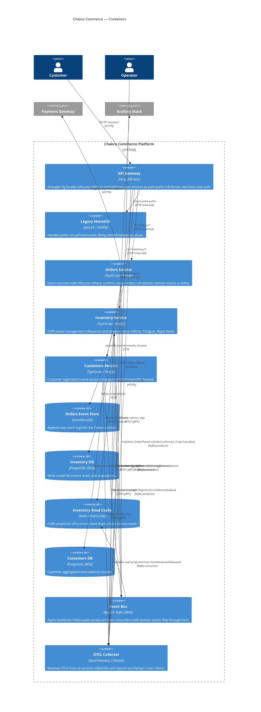

# Container Diagram (C4 Level 2)

## Traffic Routing During Migration

The Kong gateway is the strangler fig control plane. Traffic is routed by URL path prefix:

| Path prefix | Destination | Phase introduced |
|---|---|---|
| `/v1/customers/*` | Customers Service | Phase 2 |
| `/v1/inventory/*` | Inventory Service | Phase 3 |
| `/v1/orders/*` | Orders Service | Phase 4 (planned) |
| All other paths | Legacy Monolith | Phase 1 (until decommission) |

Canary weights are configurable in [`infrastructure/helm/charts/api-gateway/values-production.yaml`](../../infrastructure/helm/charts/api-gateway/values-production.yaml). A phase starts at 1% canary, ramps to 100% after SLA validation.
