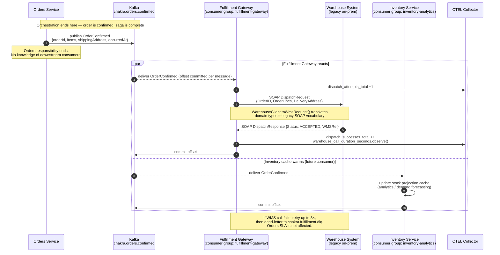

# Sequence Diagram: Choreography — OrderConfirmed Flow

This diagram shows the choreography-based flow triggered when an order is confirmed. Contrast with [`sequence-place-order.md`](sequence-place-order.md), which uses saga orchestration with a central coordinator.

In choreography, the Orders service publishes a domain event and is done. It does not know who is listening. Each consumer reacts independently at its own pace.

---



---

## Key Properties

**Decoupling**: The Orders service has no reference to the Fulfillment Gateway or Inventory analytics consumers. Adding a new consumer (notification service, audit log) requires zero changes in Orders.

**Independent failure domains**: A WMS outage that opens the circuit breaker in the Fulfillment Gateway causes consumer lag to accumulate on `chakra.orders.confirmed`. The Orders service continues placing and confirming orders unaffected. The Fulfillment SLA is breached; the Orders SLA is not.

**Contrast with Orchestration**: In the place-order saga, the Orders service issues a `ReserveStock` command and waits for the result before proceeding. The outcome of each step determines whether the saga continues or compensates. Choreography has none of this — the event is published once, and each consumer is self-contained.

---

## Observability

Tracing the full chain requires distributed tracing (ADR-0008). The `OrderConfirmed` event carries the `traceId` from the originating `PlaceOrder` request. The Fulfillment Gateway propagates this `traceId` on its WMS SOAP call, making the full chain visible in Grafana Tempo:

```
PlaceOrder HTTP request
  └── ReserveStock command (saga orchestration)
  └── CapturePayment (saga orchestration)
  └── OrderConfirmed published
        └── Fulfillment Gateway: dispatchFulfillment (choreography)
              └── WMS SOAP call
```
