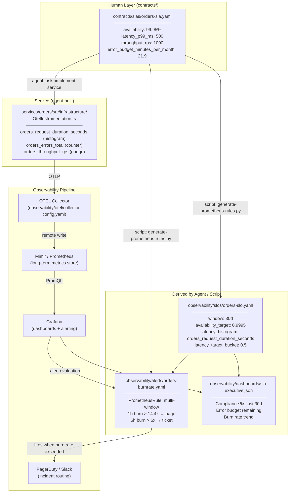

# SLA Measurement Flow

How SLA targets defined by humans flow into runtime measurement, alerting, and executive reporting.

## The Pipeline



---

## What Each Layer Does

### `contracts/slas/orders-sla.yaml` (human-authored)
The authoritative statement of what the business has committed to. Written by engineers with stakeholder sign-off. Contains numeric targets that are the single source of truth. No one derives SLO windows or alert thresholds without reading this file.

### `observability/slos/orders-slo.yaml` (script-generated)
Translates business SLA targets into Prometheus-queryable SLO definitions: time windows, metric names, target percentages. Generated by `tooling/generate-prometheus-rules.py` from the SLA YAML. If the SLA target changes, re-run the script; the SLO YAML updates automatically.

### `observability/alerts/orders-burnrate.yaml` (script-generated)
Multi-window burn rate PrometheusRules generated from the SLO definition. Uses the Google SRE burn rate model:
- **Fast burn (1h window, 14.4x rate)**: pages on-call immediately — error budget gone in < 2 days
- **Slow burn (6h window, 6x rate)**: creates a ticket — error budget gone in < 5 days

### `services/orders/src/infrastructure/OtelInstrumentation.ts` (agent-built)
Registers the exact metric names and histogram bucket boundaries that the SLO queries depend on. The OTEL instrumentation is built from the SLA file as input — bucket boundaries are derived from the `latency_p99_ms` target so the histogram captures the right resolution around the SLA threshold.

### `observability/dashboards/sla-executive.json` (agent-built)
A Grafana dashboard that answers the question any executive or customer can ask: *are we meeting our commitments?* Shows 30-day compliance percentage, remaining error budget as a countdown, and burn rate trend. Derived from SLO definitions, not from raw metrics.

---

## Error Budget Model

```
Monthly error budget = (1 - availability_target) × 30 days × 24 hours × 60 minutes

Orders example:
  (1 - 0.9995) × 43,200 minutes = 21.6 minutes per month

At a 14.4x burn rate, this budget is exhausted in:
  21.6 / 14.4 = 1.5 hours

This is why the fast-burn alert fires immediately.
```

---

## Traceability Guarantee

`tooling/validate-contracts.sh` enforces that this chain is never broken:

1. Every `contracts/slas/*.yaml` has a matching `observability/slos/*.yaml`
2. Every SLO references metric names that appear in an `OtelInstrumentation.ts`
3. Every SLO has at least one burn rate alert in `observability/alerts/`

A CI failure on this check means an SLA exists with no measurement. That is a compliance gap, not a code gap.
