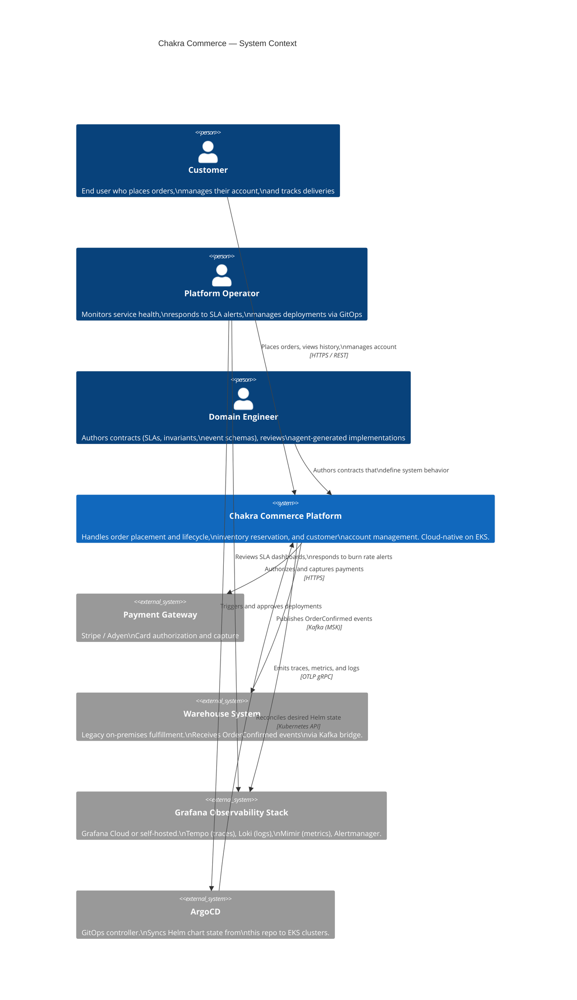

# System Context Diagram (C4 Level 1)

## Boundaries and Responsibilities

| Actor / System | Owns | Does not own |
|---|---|---|
| Chakra Commerce Platform | Order, Inventory, Customer domains | Payment processing, physical fulfillment |
| Payment Gateway | Card authorization and fraud | Order state, inventory |
| Warehouse System | Physical fulfillment execution | Stock levels (reads from Inventory via event) |
| Grafana Stack | Observability storage and alerting | Application logic, deployment |
| ArgoCD | Deployment reconciliation | Service implementation, config authoring |
| Domain Engineer | Contract correctness | Implementation volume |
| Platform Operator | Runtime SLA compliance | Contract authoring |
