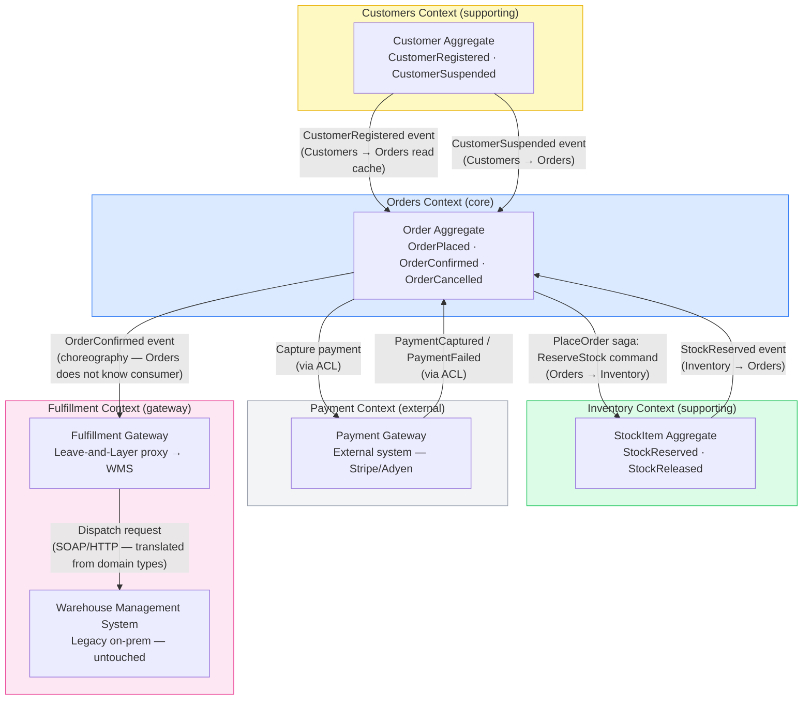

# Bounded Contexts

## Overview

Chakra Commerce is divided into four bounded contexts. Within each context, the model is consistent and the ubiquitous language applies without qualification. Across context boundaries, integration happens through versioned events and APIs — never through shared databases or direct object references.

---

## Context Map

---

## Context Relationships

| Relationship | Type | Description |
|---|---|---|
| Orders → Inventory | **Partnership** | Both teams coordinate on saga protocol and event schema evolution |
| Orders → Customers | **Downstream (conformist)** | Orders consumes Customer events; conforms to Customer's model |
| Orders → Payment | **Anti-corruption layer** | Payment Gateway uses external vocabulary; ACL translates to Orders model |
| Inventory → Orders | **Upstream (open host)** | Inventory publishes a stable event API; Orders is one of many consumers |
| Orders → Fulfillment | **Choreography (published event)** | Orders publishes `OrderConfirmed`; Fulfillment Gateway consumes independently |
| Fulfillment → WMS | **Leave-and-layer proxy** | Gateway translates domain types to legacy SOAP; WMS is untouched |

---

## Contexts Summary

| Context | Type | Core concept | Owner team | Extracted? |
|---|---|---|---|---|
| Orders | Core domain | Order lifecycle + saga | orders-team | Phase 4 (planned) |
| Inventory | Supporting | Stock reservation + CQRS | inventory-team | Phase 3 (in progress) |
| Customers | Supporting | Customer registration | customers-team | Phase 2 (done) |
| Payment | External | Card processing | vendor | N/A |
| Fulfillment | Gateway (leave-and-layer) | WMS proxy; async dispatch | platform-team | Deployed (permanent until WMS replaced) |

---

## Integration Patterns Used

**Published Language (Events)**: Domain events defined in `contracts/event-schemas/` are the primary integration mechanism. Consumers read from Kafka topics and maintain local projections.

**Anti-Corruption Layer (Payment)**: The Orders service wraps the Payment Gateway API with a `PaymentGatewayAdapter` that translates external types (`ChargeResult`, `RefundResult`) into Orders domain types (`PaymentCaptured`, `PaymentFailed`).

**Open Host Service (Inventory API)**: The Inventory service exposes a stable REST API for stock reservation commands. Multiple consumers (Orders, future warehouse system) can use it without knowing Inventory internals.

**Leave-and-Layer (Fulfillment Gateway)**: The legacy Warehouse Management System is left exactly as-is. The Fulfillment Gateway is a new service that layers a modern async interface on top — subscribing to `OrderConfirmed` events on Kafka and translating them into WMS SOAP calls. The WMS vendor contract, deployment, and protocol are untouched. See [ADR-0011](../adrs/ADR-0011-leave-and-layer-warehouse.md) and the contrast with Strangler Fig in [ADR-0003](../adrs/ADR-0003-strangler-fig-migration.md).
