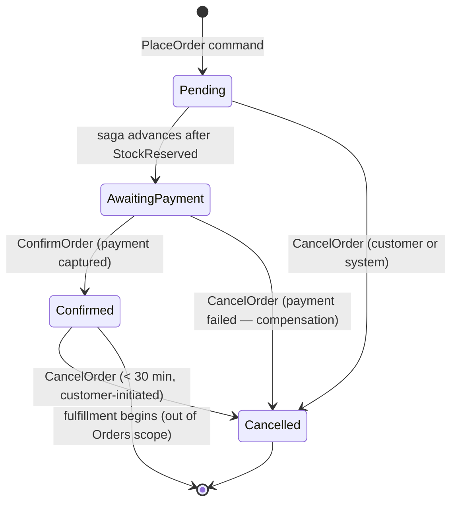

# Orders Domain Model

## Bounded Context Summary

The Orders context owns the lifecycle of a customer's purchase from intent (placement) to outcome (confirmation or cancellation). It is the saga orchestrator for the place-order flow and is responsible for coordinating with Inventory and Payment while maintaining the invariants defined in [`contracts/domain-invariants/orders-invariants.md`](../../../contracts/domain-invariants/orders-invariants.md).

**Owner team**: orders-team
**Data store**: EventStoreDB (event sourcing per [ADR-0006](../../adrs/ADR-0006-event-sourcing-orders.md))
**Integration**: Publishes to `chakra.orders.*` Kafka topics; consumes from `chakra.inventory.*` and `chakra.customers.*`

---

## Aggregates

| Aggregate | Root | Entities | Value Objects |
|---|---|---|---|
| Order | `Order` | `OrderItem` | `Money`, `OrderStatus`, `ShippingAddress` |

Only `Order` and `OrderItem` are persistence concerns. `Money`, `OrderStatus`, and `ShippingAddress` are value objects — they have no identity outside the Order that contains them.

---

## Order Aggregate Detail

### Invariants Enforced
All invariants from [`orders-invariants.md`](../../../contracts/domain-invariants/orders-invariants.md) are enforced at the aggregate boundary. An aggregate method that would violate an invariant must throw a domain error before any event is appended.

| Invariant | Enforced in |
|---|---|
| INV-ORD-001: At least one item | `Order.place()` |
| INV-ORD-002: Positive quantities | `Order.place()` + `OrderItem` constructor |
| INV-ORD-003: Valid status transitions | `Order.transitionTo()` guard |
| INV-ORD-004: Payment reference on confirmation | `Order.confirm()` |
| INV-ORD-005: Immutable after confirmation | `Order.apply()` guard |
| INV-ORD-006: Total = sum of line items | `Order.place()` |
| INV-ORD-010: Unique IDs | EventStoreDB optimistic concurrency |

### Commands and Events

| Command | Pre-condition | Event appended | Post-condition |
|---|---|---|---|
| `PlaceOrder` | Customer not suspended; items non-empty; total correct | `OrderPlaced` | Status = `Pending` |
| `MarkAwaitingPayment` | Status = `Pending` | `OrderAwaitingPayment` | Status = `AwaitingPayment` |
| `ConfirmOrder` | Status = `AwaitingPayment`; paymentRef present | `OrderConfirmed` | Status = `Confirmed` |
| `CancelOrder` | Status ∈ {Pending, AwaitingPayment} or (Confirmed and < 30 min) | `OrderCancelled` | Status = `Cancelled` |

---

## State Machine



---

## Repository Contract

```typescript
interface OrderRepository {
  save(order: Order): Promise<void>;
  findById(orderId: string): Promise<Order | null>;
  // Saves by appending uncommitted events to the EventStoreDB stream.
  // findById reconstructs the aggregate from the event stream.
  // Expected version is passed to enforce optimistic concurrency (INV-ORD-010).
}
```

---

## Domain Services

**`OrderTotalCalculator`**: Validates and calculates the order total from line items. Extracted as a domain service because the calculation logic may involve tax rules that are external to the Order aggregate. The aggregate delegates the calculation check to this service during `Place`.

**`PlaceOrderSagaOrchestrator`** (application layer, not domain): Coordinates the sequence: reserve stock → capture payment → confirm order. Lives in the application layer, not the domain layer, because it involves I/O and depends on external services.
