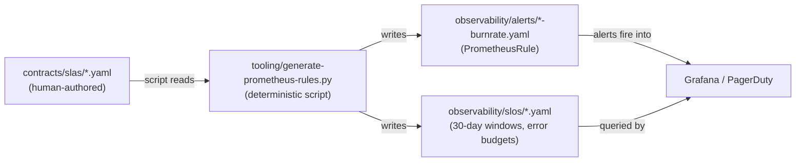

# Observability

SLA measurement is not an afterthought in this architecture. It is woven in from the first contract file to the last Prometheus alert. Every numeric target is written once in `contracts/slas/` and flows downstream through a deterministic pipeline to runtime alerts.

---

## The SLA → Alert Pipeline



A target is written **once** — in `contracts/slas/`. The script is idempotent. Running it again produces identical output. `validate-contracts.sh` in CI verifies every SLA file has a matching SLO file and a matching alert file.

See the [SLA Measurement Flow diagram](../architecture/diagrams/sla-measurement-flow.md) for the full signal path from service instrumentation to on-call alert.

---

## Multi-Window Burn Rate Alerting

Following the Google SRE model, each SLO has two alert tiers:

| Tier | Window | Burn rate threshold | Action | Alert for |
|---|---|---|---|---|
| **Fast burn** | 1 hour | 14.4× | Page on-call immediately | Consuming 1% of monthly budget per hour |
| **Slow burn** | 6 hours | 6× | Create ticket | Sustained degradation that won't page but will exhaust budget |

The 14.4× rate means: if continued for the whole window, 100% of the monthly error budget would be consumed. The 6× rate means the same across 6 hours. Both tiers fire `for: 2m` and `for: 15m` respectively, suppressing transient spikes.

!!! example "Reference Implementation"
    | File | What it contains |
    |---|---|
    | [`observability/alerts/orders-burnrate.yaml`](https://github.com/naren-chakraview/chakraview-enterprise-modernization/blob/main/observability/alerts/orders-burnrate.yaml) | Fast + slow burn for Orders availability and latency; saga compensation rate alert |
    | [`observability/alerts/inventory-burnrate.yaml`](https://github.com/naren-chakraview/chakraview-enterprise-modernization/blob/main/observability/alerts/inventory-burnrate.yaml) | Reservation success rate; read latency; consumer lag |
    | [`observability/alerts/customers-burnrate.yaml`](https://github.com/naren-chakraview/chakraview-enterprise-modernization/blob/main/observability/alerts/customers-burnrate.yaml) | Registration latency; GDPR deletion SLA |
    | [`observability/alerts/platform-burnrate.yaml`](https://github.com/naren-chakraview/chakraview-enterprise-modernization/blob/main/observability/alerts/platform-burnrate.yaml) | EKS availability; node health |

---

## Histogram Buckets Derived from SLA Targets

The OTEL histogram buckets in each service are not arbitrary. They are generated to include the SLA `latency_p99_ms` target as a bucket boundary.

For Orders (`latency_p99_ms: 500`), the bucket at `0.5s` must exist so that `histogram_quantile(0.99, ...)` can resolve exactly at the SLA threshold:

```typescript
// services/orders/src/infrastructure/OtelInstrumentation.ts
const LATENCY_BUCKETS = [0.005, 0.01, 0.025, 0.05, 0.1, 0.25, 0.5, 1.0, 2.5];
//                                                              ^^^
//                                              SLA p99 = 500ms → 0.5s boundary
```

If the bucket does not exist, `histogram_quantile(0.99, ...)` interpolates between 0.25 and 1.0 — the result is inaccurate relative to the SLA. The compliance agent checks this in Phase 5.

!!! example "Reference Implementation"
    | File | Bucket boundary |
    |---|---|
    | [`services/orders/src/infrastructure/OtelInstrumentation.ts`](https://github.com/naren-chakraview/chakraview-enterprise-modernization/blob/main/services/orders/src/infrastructure/OtelInstrumentation.ts) | `0.5s` (Orders p99 = 500ms) |
    | [`services/fulfillment-gateway/src/infrastructure/OtelInstrumentation.ts`](https://github.com/naren-chakraview/chakraview-enterprise-modernization/blob/main/services/fulfillment-gateway/src/infrastructure/OtelInstrumentation.ts) | `2.0s` (Fulfillment WMS p99 = 2000ms) |

---

## Three Pillars via One Pipeline

All telemetry flows through a single OTEL pipeline. Services emit to `localhost:4317` (the OTEL Collector sidecar — see [Sidecar pattern](../patterns/index.md#sidecar)). The collector forwards to:

| Signal | Backend | Used for |
|---|---|---|
| **Traces** | Grafana Tempo | Distributed tracing; full saga chain reconstruction |
| **Metrics** | Grafana Mimir | SLO queries, burn rate alerts, dashboards |
| **Logs** | Grafana Loki | Structured log search; correlated with traces via `traceId` |

!!! example "Reference Implementation"
    | File | Purpose |
    |---|---|
    | [`observability/otel/collector-config.yaml`](https://github.com/naren-chakraview/chakraview-enterprise-modernization/blob/main/observability/otel/collector-config.yaml) | OTLP receive → batch processor → Tempo/Mimir/Loki exporters |
    | [`observability/otel/instrumentation-cr.yaml`](https://github.com/naren-chakraview/chakraview-enterprise-modernization/blob/main/observability/otel/instrumentation-cr.yaml) | OTEL Operator `Instrumentation` CR: auto-injects collector into all `chakra-*` namespaces |
    | [`ai-agents/context/observability-requirements.md`](https://github.com/naren-chakraview/chakraview-enterprise-modernization/blob/main/ai-agents/context/observability-requirements.md) | Required metric names, span names, log fields — the standard every agent-built service must meet |

---

## SLO Files

Each SLO YAML file repeats the SLA target into a Prometheus-queryable specification with window, error budget minutes, and alert tier thresholds:

| SLO file | Availability target | Error budget | p99 latency |
|---|---|---|---|
| [`orders-slo.yaml`](https://github.com/naren-chakraview/chakraview-enterprise-modernization/blob/main/observability/slos/orders-slo.yaml) | 99.95% | 21.6 min/month | 500ms |
| [`inventory-slo.yaml`](https://github.com/naren-chakraview/chakraview-enterprise-modernization/blob/main/observability/slos/inventory-slo.yaml) | 99.9% | 43.2 min/month | read 100ms |
| [`customers-slo.yaml`](https://github.com/naren-chakraview/chakraview-enterprise-modernization/blob/main/observability/slos/customers-slo.yaml) | 99.9% | 43.2 min/month | 300ms |
| [`platform-slo.yaml`](https://github.com/naren-chakraview/chakraview-enterprise-modernization/blob/main/observability/slos/platform-slo.yaml) | 99.95% | 21.6 min/month | — |

---

## Runbooks

When a burn rate alert fires, the [SLA Breach Response runbook](../runbooks/sla-breach-response.md) provides a structured response: fast burn vs. slow burn triage, 5-step process, and escalation matrix.
