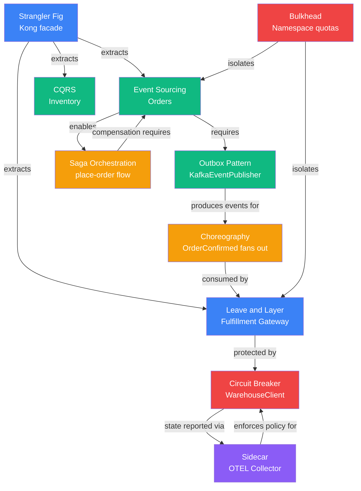

# Pattern Catalogue

Ten architecture patterns are demonstrated in this reference implementation. Each is backed by an [Architecture Decision Record](../adrs/README.md), a concrete implementation in the codebase, and cross-references to the SLA contracts that motivate it.

Patterns are grouped by concern. Many interact — the [pattern interaction map](#pattern-interaction-map) at the bottom shows how.

---

## Migration Patterns

### Strangler Fig

**ADR**: [ADR-0003](../adrs/ADR-0003-strangler-fig-migration.md) · **Type**: Migration

The Kong API gateway is deployed as a facade in front of the Java EE monolith from day one. Traffic is routed by URL path prefix. As each bounded context is extracted, its paths are re-routed from the monolith to the new service. The monolith shrinks one context at a time; it is never rewritten.

Each phase ends with a validation period (SLA compliance confirmed) before the monolith handlers for that context are disabled. Any phase can be reversed within 5 minutes by updating Kong routing config.

!!! example "Where it lives in the codebase"
    | Artifact | Purpose |
    |---|---|
    | [`docs/migration/strategy.md`](../migration/strategy.md) | 5-phase migration plan with rollback gates |
    | [`infrastructure/helm/charts/api-gateway/`](https://github.com/naren-chakraview/chakraview-enterprise-modernization/tree/main/infrastructure/helm/charts/api-gateway) | Kong Helm chart with strangler-fig routing config |
    | [`docs/adrs/ADR-0003`](../adrs/ADR-0003-strangler-fig-migration.md) | Why not a big-bang rewrite |

**Key constraint**: Each extraction is independently reversible. The monolith is not modified — only Kong routing changes.

---

### Leave and Layer

**ADR**: [ADR-0011](../adrs/ADR-0011-leave-and-layer-warehouse.md) · **Type**: Migration / Integration

The Warehouse Management System (WMS) is a vendor on-prem product that cannot be modified. Rather than replacing it in parallel with the Orders extraction, the **Fulfillment Gateway** is deployed as a new asynchronous layer: it subscribes to `OrderConfirmed` events on Kafka and translates them to WMS SOAP calls.

This is the critical distinction from Strangler Fig: **Strangler Fig replaces the old system**. Leave-and-Layer accepts it as a long-lived dependency and adapts to it. The WMS vendor contract, SOAP API, and deployment are completely untouched.

!!! example "Where it lives in the codebase"
    | Artifact | Purpose |
    |---|---|
    | [`services/fulfillment-gateway/src/infrastructure/WarehouseClient.ts`](https://github.com/naren-chakraview/chakraview-enterprise-modernization/blob/main/services/fulfillment-gateway/src/infrastructure/WarehouseClient.ts) | The layer: translates domain types to legacy SOAP vocabulary |
    | [`services/fulfillment-gateway/src/application/OrderConfirmedHandler.ts`](https://github.com/naren-chakraview/chakraview-enterprise-modernization/blob/main/services/fulfillment-gateway/src/application/OrderConfirmedHandler.ts) | Kafka consumer — the entry point |
    | [`contracts/slas/fulfillment-sla.yaml`](https://github.com/naren-chakraview/chakraview-enterprise-modernization/blob/main/contracts/slas/fulfillment-sla.yaml) | Independent SLA for the gateway; WMS outage ≠ Orders SLA breach |
    | [`docs/migration/warehouse-leave-and-layer.md`](../migration/warehouse-leave-and-layer.md) | Deployment phases and rollback |

**Key insight**: `WarehouseClient.ts` contains two vocabulary layers. `WmsDispatchRequest` (private type, matches 2004 SOAP schema) is the legacy surface. `FulfillmentRequest` (exported) is the domain surface. Nothing outside `WarehouseClient.ts` knows `WmsDispatchRequest` exists.

---

## Data Patterns

### Event Sourcing

**ADR**: [ADR-0006](../adrs/ADR-0006-event-sourcing-orders.md) · **Type**: Data / State Management

The Orders domain uses EventStoreDB as its system of record. Every state transition appends an immutable event to the order's stream. Current state is reconstructed by replaying the stream. The mutable row is gone.

Three properties justify event sourcing specifically for Orders (not for Inventory or Customers):

1. **Full audit trail** — every price change, cancellation reason, and address update is in the stream permanently
2. **Saga compensation** — when the place-order saga must be rolled back, the event stream gives a causal chain to replay in a test context before committing compensation
3. **Temporal queries** — "what was the state of this order at 14:32?" is a stream replay, not a dedicated audit table

!!! example "Where it lives in the codebase"
    | Artifact | Purpose |
    |---|---|
    | [`services/orders/src/domain/Order.ts`](https://github.com/naren-chakraview/chakraview-enterprise-modernization/blob/main/services/orders/src/domain/Order.ts) | Aggregate root: `reconstitute()` replays events, `apply()` dispatches each |
    | [`services/orders/src/domain/OrderStatus.ts`](https://github.com/naren-chakraview/chakraview-enterprise-modernization/blob/main/services/orders/src/domain/OrderStatus.ts) | State machine with `assertValidTransition()` guard |
    | [`services/orders/src/infrastructure/OrderRepository.ts`](https://github.com/naren-chakraview/chakraview-enterprise-modernization/blob/main/services/orders/src/infrastructure/OrderRepository.ts) | EventStoreDB-backed repository stub |
    | [`contracts/event-schemas/`](https://github.com/naren-chakraview/chakraview-enterprise-modernization/tree/main/contracts/event-schemas) | Canonical JSON Schemas for all domain events |

**Key constraint**: Event sourcing is used **only in the Orders domain** (ADR-0006). Inventory and Customers use PostgreSQL CRUD with row versioning.

---

### CQRS

**ADR**: [ADR-0007](../adrs/ADR-0007-cqrs-inventory.md) · **Type**: Data / Performance

Inventory has a 10:1 read-to-write ratio. Stock level queries must be sub-10ms; reservation writes need strong consistency. A single PostgreSQL store cannot satisfy both requirements at the required throughput.

The write model (PostgreSQL) handles all `ReserveStock` and `ReleaseStock` commands with row-level locking. A Kafka consumer maintains a Redis hash projection of current stock levels. Reads go to Redis exclusively.

The two models diverge by at most one Kafka consumer lag interval (target: <100ms). This divergence is explicitly documented in the Inventory SLA and enforced by a consumer lag alert.

!!! example "Where it lives in the codebase"
    | Artifact | Purpose |
    |---|---|
    | [`contracts/domain-invariants/inventory-invariants.md`](https://github.com/naren-chakraview/chakraview-enterprise-modernization/blob/main/contracts/domain-invariants/inventory-invariants.md) | INV-INV-006: Redis is not authoritative for write decisions |
    | [`contracts/slas/inventory-sla.yaml`](https://github.com/naren-chakraview/chakraview-enterprise-modernization/blob/main/contracts/slas/inventory-sla.yaml) | Read p99 100ms; write p99 300ms; oversell tolerance 0 |
    | [`observability/slos/inventory-slo.yaml`](https://github.com/naren-chakraview/chakraview-enterprise-modernization/blob/main/observability/slos/inventory-slo.yaml) | SLO spec derived from the SLA |
    | [`observability/alerts/inventory-burnrate.yaml`](https://github.com/naren-chakraview/chakraview-enterprise-modernization/blob/main/observability/alerts/inventory-burnrate.yaml) | Burn rate alerts for reservation success rate and read latency |

**Key constraint**: INV-INV-006 states that no write decision may use the Redis projection as input. A reservation that reads from Redis to check stock could race with an uncommitted write. Aggregates read from PostgreSQL; Redis serves only query endpoints.

---

### Outbox Pattern

**Referenced in**: [ADR-0006](../adrs/ADR-0006-event-sourcing-orders.md), [ADR-0004](../adrs/ADR-0004-kafka-event-bus.md) · **Type**: Data / Reliability

Domain events are never published directly from command handlers. A dedicated outbox process reads the EventStoreDB stream and publishes to Kafka topics. This decouples the command commit from the Kafka publish and guarantees at-least-once delivery without distributed transactions.

!!! example "Where it lives in the codebase"
    | Artifact | Purpose |
    |---|---|
    | [`services/orders/src/infrastructure/KafkaEventPublisher.ts`](https://github.com/naren-chakraview/chakraview-enterprise-modernization/blob/main/services/orders/src/infrastructure/KafkaEventPublisher.ts) | Outbox consumer stub: reads EventStoreDB, publishes to Kafka |
    | [`ai-agents/tasks/agent/architectural-compliance-review.md`](https://github.com/naren-chakraview/chakraview-enterprise-modernization/blob/main/ai-agents/tasks/agent/architectural-compliance-review.md) | Phase 5 check: events published via outbox, not directly from command handlers |

---

## Integration Patterns

### Saga Orchestration

**ADR**: [ADR-0006](../adrs/ADR-0006-event-sourcing-orders.md) · **Type**: Integration / Distributed Transactions

The place-order flow is a distributed transaction across three systems. The Orders service acts as the orchestrator: it issues commands, waits for outcomes, and triggers compensation when a step fails.

```
PlaceOrder command
  ↓
1. ReserveStock (Inventory) — wait for StockReserved
  ↓
2. CapturePayment (Payment Gateway) — wait for PaymentCaptured
  ↓ (if PaymentFailed)
  → ReleaseStock (compensation) → OrderCancelled
  ↓ (if PaymentCaptured)
3. ConfirmOrder → OrderConfirmed published
```

!!! example "Where it lives in the codebase"
    | Artifact | Purpose |
    |---|---|
    | [`services/orders/src/application/PlaceOrderCommand.ts`](https://github.com/naren-chakraview/chakraview-enterprise-modernization/blob/main/services/orders/src/application/PlaceOrderCommand.ts) | Saga orchestrator skeleton |
    | [`services/orders/src/domain/Order.ts`](https://github.com/naren-chakraview/chakraview-enterprise-modernization/blob/main/services/orders/src/domain/Order.ts) | Enforces `INV-ORD-007`: stock reserved before payment captured |
    | [`contracts/slas/orders-sla.yaml`](https://github.com/naren-chakraview/chakraview-enterprise-modernization/blob/main/contracts/slas/orders-sla.yaml) | `saga_compensation.max_ms: 5000` — compensation must complete within 5s |
    | [`observability/alerts/orders-burnrate.yaml`](https://github.com/naren-chakraview/chakraview-enterprise-modernization/blob/main/observability/alerts/orders-burnrate.yaml) | `OrdersSagaCompensationRateHigh` alert fires when compensation rate exceeds 5% |

**Key constraint**: Compensation events must be published via the outbox (not in-memory) so they survive a crash during the compensation phase. The `saga_compensation.max_ms` SLA target is enforced by a histogram bucket in `OtelInstrumentation.ts`.

---

### Choreography

**ADR**: [ADR-0015](../adrs/ADR-0015-choreography-events.md) · **Type**: Integration / Event-Driven

Orchestration is used when outcome matters. Choreography is used when it doesn't. When an order is confirmed, the Orders service publishes `OrderConfirmed` and is done — it has no knowledge of the Fulfillment Gateway, inventory cache consumers, or any future analytics pipeline.

| Event | Producer | Consumers | Why choreography |
|---|---|---|---|
| `OrderConfirmed` | Orders | Fulfillment Gateway | WMS failure ≠ Orders SLA breach |
| `CustomerRegistered` | Customers | Inventory (cache warm) | Cache miss is a performance issue, not a correctness issue |
| `CustomerSuspended` | Customers | Orders (cache invalidation) | Invalidation is eventually consistent by design |

!!! example "Where it lives in the codebase"
    | Artifact | Purpose |
    |---|---|
    | [`docs/architecture/diagrams/sequence-choreography.md`](../architecture/diagrams/sequence-choreography.md) | Sequence diagram: `OrderConfirmed` fan-out and independent consumer failure |
    | [`services/fulfillment-gateway/src/application/OrderConfirmedHandler.ts`](https://github.com/naren-chakraview/chakraview-enterprise-modernization/blob/main/services/fulfillment-gateway/src/application/OrderConfirmedHandler.ts) | Primary choreography consumer |
    | [`api/asyncapi/orders-events-v1.yaml`](https://github.com/naren-chakraview/chakraview-enterprise-modernization/blob/main/api/asyncapi/orders-events-v1.yaml) | AsyncAPI contract listing all `OrderConfirmed` consumers |

---

## Resilience Patterns

### Circuit Breaker

**ADR**: [ADR-0012](../adrs/ADR-0012-circuit-breaker.md) · **Type**: Resilience

Two external calls in the system can fail unpredictably: Orders → Payment Gateway, and Fulfillment Gateway → WMS. Without a circuit breaker, a degraded downstream holds connections open until the caller's pool is exhausted.

The pattern is implemented at two levels:

=== "Infrastructure level (Istio)"
    `DestinationRule` with `outlierDetection` in each service's Helm chart. No application code changes. Applied to all in-mesh calls.

    ```yaml
    outlierDetection:
      consecutive5xxErrors: 5
      interval: 30s
      baseEjectionTime: 30s
      maxEjectionPercent: 100
    ```

=== "Application level (WarehouseClient)"
    The WMS endpoint is out-of-mesh (on-prem SOAP). `WarehouseClient.ts` implements a three-state machine (closed/open/half-open) with thresholds sourced from `contracts/slas/fulfillment-sla.yaml`.

    ```typescript
    private enforceCircuitBreaker(): void {
      if (this.circuitState === 'open') {
        const elapsed = Date.now() - this.lastOpenedAt;
        if (elapsed >= this.OPEN_DURATION_MS) {
          this.circuitState = 'half-open'; // probe
        } else {
          throw new CircuitOpenError('WMS circuit breaker is open');
        }
      }
    }
    ```

!!! example "Where it lives in the codebase"
    | Artifact | Purpose |
    |---|---|
    | [`services/fulfillment-gateway/src/infrastructure/WarehouseClient.ts`](https://github.com/naren-chakraview/chakraview-enterprise-modernization/blob/main/services/fulfillment-gateway/src/infrastructure/WarehouseClient.ts) | Application-level state machine |
    | [`infrastructure/helm/charts/orders-service/templates/destination-rule.yaml`](https://github.com/naren-chakraview/chakraview-enterprise-modernization/blob/main/infrastructure/helm/charts/orders-service/templates/destination-rule.yaml) | Istio rule: Payment Gateway egress (tight: 3 failures, 60s ejection) |
    | [`infrastructure/helm/charts/fulfillment-gateway/templates/destination-rule.yaml`](https://github.com/naren-chakraview/chakraview-enterprise-modernization/blob/main/infrastructure/helm/charts/fulfillment-gateway/templates/destination-rule.yaml) | Istio rule: in-mesh dependencies |
    | [`contracts/slas/fulfillment-sla.yaml`](https://github.com/naren-chakraview/chakraview-enterprise-modernization/blob/main/contracts/slas/fulfillment-sla.yaml) | Circuit breaker thresholds (human-authored source of truth) |

**Key constraint**: The `circuit_breaker_state` gauge (`0=closed, 1=open, 2=half-open`) is a required OTEL metric for any service with external calls. The state must be observable in Grafana without log parsing.

---

### Bulkhead Isolation

**ADR**: [ADR-0013](../adrs/ADR-0013-bulkhead-isolation.md) · **Type**: Resilience

Failures in the Fulfillment Gateway (a background service) must not be able to evict Orders pods or exhaust Orders' connection pools. Two isolation layers enforce this.

=== "Namespace quotas (coarse)"
    Each bounded context has a `ResourceQuota` that caps total CPU and memory. A Fulfillment Gateway memory leak hits the `chakra-fulfillment` quota before it can affect `chakra-orders`.

    | Namespace | CPU limit | Memory limit |
    |---|---|---|
    | `chakra-orders` | 6 cores | 6Gi |
    | `chakra-inventory` | 12 cores | 12Gi |
    | `chakra-customers` | 1.5 cores | 1.5Gi |
    | `chakra-fulfillment` | 1.2 cores | 1.2Gi |

=== "Connection pool limits (fine)"
    Each service's `DestinationRule` sets explicit `connectionPool` limits per downstream. A degraded Payment Gateway can hold at most 20 TCP connections from the Orders service — additional requests get a fast 503, which the circuit breaker counts.

!!! example "Where it lives in the codebase"
    | Artifact | Purpose |
    |---|---|
    | [`infrastructure/kubernetes/policies/resource-quotas.yaml`](https://github.com/naren-chakraview/chakraview-enterprise-modernization/blob/main/infrastructure/kubernetes/policies/resource-quotas.yaml) | All five namespace quotas + LimitRanges with formula comments |
    | [`infrastructure/helm/charts/orders-service/templates/destination-rule.yaml`](https://github.com/naren-chakraview/chakraview-enterprise-modernization/blob/main/infrastructure/helm/charts/orders-service/templates/destination-rule.yaml) | `connectionPool.tcp.maxConnections: 20` for Payment Gateway |
    | [`tooling/service-manifest.yaml`](https://github.com/naren-chakraview/chakraview-enterprise-modernization/blob/main/tooling/service-manifest.yaml) | Source of truth for resource sizing; quotas derived from `limits × max_replicas × 1.2` |

---

### Sidecar

**ADR**: [ADR-0014](../adrs/ADR-0014-sidecar-mesh.md) · **Type**: Resilience / Observability

Three cross-cutting behaviors — mTLS, traffic policy, and telemetry — are moved out of application code into two injected sidecars. Service authors write business logic and OTEL SDK calls. They implement no TLS code, no retry logic, and no metrics transport.

| Sidecar | Injected by | Responsibilities |
|---|---|---|
| **Envoy** | Istio control plane | mTLS (SPIFFE/X.509), DestinationRule enforcement, trace context propagation |
| **OTEL Collector** | OpenTelemetry Operator | Receives OTLP on `localhost:4317`, batches, forwards to Grafana Tempo/Mimir/Loki |

!!! example "Where it lives in the codebase"
    | Artifact | Purpose |
    |---|---|
    | [`infrastructure/helm/charts/orders-service/templates/deployment.yaml`](https://github.com/naren-chakraview/chakraview-enterprise-modernization/blob/main/infrastructure/helm/charts/orders-service/templates/deployment.yaml) | Both injection annotations on the pod spec |
    | [`observability/otel/instrumentation-cr.yaml`](https://github.com/naren-chakraview/chakraview-enterprise-modernization/blob/main/observability/otel/instrumentation-cr.yaml) | OTEL Operator `Instrumentation` CR: which namespaces get the collector |
    | [`services/orders/src/infrastructure/OtelInstrumentation.ts`](https://github.com/naren-chakraview/chakraview-enterprise-modernization/blob/main/services/orders/src/infrastructure/OtelInstrumentation.ts) | Application-side: creates meters, registers counters and histograms — no exporter config |

**Key constraint**: The compliance agent (Phase 4 check) verifies `sidecar.istio.io/inject: "true"` is present in every Deployment and that `PeerAuthentication` mode is `STRICT` in every `chakra-*` namespace.

---

## Pattern Interaction Map

The patterns don't stand alone. Each one enables or constrains another.



---

## Pattern Summary Table

| Pattern | ADR | Type | Used in |
|---|---|---|---|
| [Strangler Fig](#strangler-fig) | ADR-0003 | Migration | All service extractions via Kong |
| [Leave and Layer](#leave-and-layer) | ADR-0011 | Migration | Fulfillment Gateway → WMS |
| [Event Sourcing](#event-sourcing) | ADR-0006 | Data | Orders domain only |
| [CQRS](#cqrs) | ADR-0007 | Data | Inventory (PostgreSQL write + Redis read) |
| [Outbox](#outbox-pattern) | ADR-0006 | Data | EventStoreDB → Kafka |
| [Saga Orchestration](#saga-orchestration) | ADR-0006 | Integration | Place-order flow |
| [Choreography](#choreography) | ADR-0015 | Integration | OrderConfirmed → Fulfillment, cache warm |
| [Circuit Breaker](#circuit-breaker) | ADR-0012 | Resilience | Istio (in-mesh) + WarehouseClient (out-of-mesh) |
| [Bulkhead](#bulkhead-isolation) | ADR-0013 | Resilience | Namespace quotas + connection pool limits |
| [Sidecar](#sidecar) | ADR-0014 | Resilience / Observability | Envoy + OTEL Collector in every pod |
