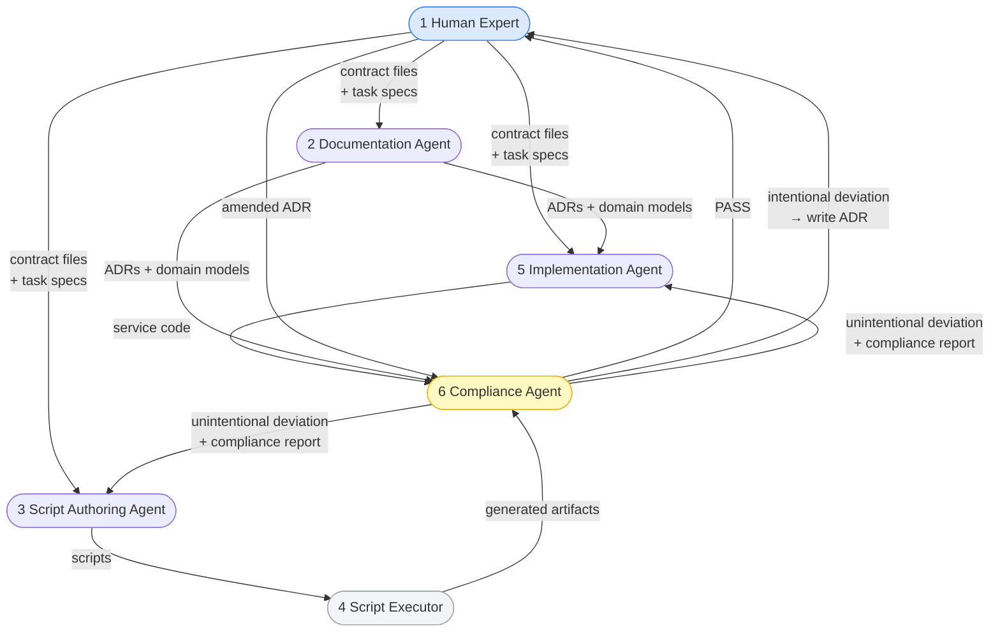

# AI Dev Model Extraction Implementation Plan

> **For agentic workers:** REQUIRED SUB-SKILL: Use superpowers:subagent-driven-development (recommended) or superpowers:executing-plans to implement this plan task-by-task. Steps use checkbox (`- [ ]`) syntax for tracking.

**Goal:** Extract the 6-persona Human-AI development framework from `chakraview-enterprise-modernization` into a standalone `chakraview-ai-dev-model` repo, and refactor enterprise-mod to focus on modernization challenges with a case study section.

**Architecture:** New repo is a domain-generic framework (model + personas + mechanism + workflow + templates). Enterprise-mod removes all framework docs and adds `docs/how-this-was-built.md` as a case study section pointing to the new repo. Cross-references are URL-only; no content is duplicated.

**Tech Stack:** MkDocs Material, Python (mkdocs), Markdown

---

## File Map

### New repo: `chakraview-ai-dev-model/`

| File | Status | Source |
|---|---|---|
| `README.md` | Create | New content |
| `mkdocs.yml` | Create | Adapted from enterprise-mod |
| `requirements-docs.txt` | Create | Copy from enterprise-mod |
| `docs/index.md` | Create | New content |
| `docs/model.md` | Create | `human-ai-model.md` §§ "Core Idea" + "Engineering Role" + ADR-0010 |
| `docs/mechanism/index.md` | Create | New overview |
| `docs/mechanism/contracts.md` | Create | `human-ai-model.md` §§ "Division of Responsibility" + "Contract→Implementation Flow" |
| `docs/mechanism/agent-vs-script.md` | Create | `human-ai-model.md` § "When to Use an Agent vs. a Script" |
| `docs/mechanism/guardrails.md` | Create | `human-ai-model.md` § "Guardrails" |
| `docs/personas/index.md` | Create | `agent-personas.md` § "Overview" + Mermaid map |
| `docs/personas/persona-1-human-domain-expert.md` | Create | `agent-personas.md` § "Persona 1" |
| `docs/personas/persona-2-documentation-agent.md` | Create | `agent-personas.md` § "Persona 2" |
| `docs/personas/persona-3-script-authoring-agent.md` | Create | `agent-personas.md` § "Persona 3" |
| `docs/personas/persona-4-script-executor.md` | Create | `agent-personas.md` § "Persona 4" |
| `docs/personas/persona-5-implementation-agent.md` | Create | `agent-personas.md` § "Persona 5" |
| `docs/personas/persona-6-compliance-agent.md` | Create | `agent-personas.md` § "Persona 6" + Compliance Report Format |
| `docs/workflow/index.md` | Create | `agent-personas.md` § "Complete Workflow" |
| `docs/task-specs/index.md` | Create | `ai-agents/README.md` § "How to Write..." + `agent-personas.md` § "Compliance Report Format" |
| `docs/case-studies/index.md` | Create | New content |
| `templates/agent-tasks/implement-service.md` | Create | Parameterised from `ai-agents/tasks/agent/implement-orders-service.md` |
| `templates/agent-tasks/compliance-review.md` | Create | Parameterised from `ai-agents/tasks/agent/architectural-compliance-review.md` |
| `templates/agent-tasks/write-adr.md` | Create | New (follows task spec structure) |
| `templates/agent-tasks/write-migration-phase.md` | Create | New (follows task spec structure) |
| `templates/agent-tasks/write-runbook.md` | Create | New (follows task spec structure) |
| `templates/script-tasks/generate-alerts.md` | Create | Parameterised from `ai-agents/tasks/script/generate-prometheus-rules.md` |
| `templates/script-tasks/generate-helm.md` | Create | New |
| `templates/script-tasks/generate-ci.md` | Create | New |
| `templates/script-tasks/validate-contracts.md` | Create | New |
| `templates/context/coding-standards.md` | Create | New (generic template) |
| `templates/context/infra-conventions.md` | Create | New (generic template) |
| `templates/context/observability-requirements.md` | Create | Parameterised from `ai-agents/context/observability-requirements.md` |

### `chakraview-enterprise-modernization/` changes

| File | Status | Change |
|---|---|---|
| `docs/architecture/human-ai-model.md` | Delete | Content moved to new repo |
| `docs/architecture/agent-personas.md` | Delete | Content moved to new repo |
| `docs/ai-agents/index.md` | Delete | Replaced by how-this-was-built.md |
| `docs/adrs/ADR-0010-ai-agent-dev-model.md` | Delete | Framework-level decision, not project ADR |
| `docs/architecture/principles.md` | Modify | Rewrite Principle 3 |
| `README.md` | Modify | Remove Human–AI section, remove ADR-0010 from table, add callout |
| `docs/index.md` | Modify | Replace AI Personas card and Human–AI Boundary section |
| `mkdocs.yml` | Modify | Remove workflow nav entries, add How This Was Built |
| `ai-agents/README.md` | Modify | Add header note pointing to new repo templates |
| `docs/how-this-was-built.md` | Create | Case study section |

---

## Phase 1: New Repo Scaffold

### Task 1: Initialise `chakraview-ai-dev-model` repo

**Files:**
- Create: `../chakraview-ai-dev-model/` (all scaffold files)

- [ ] **Step 1: Create the repo directory and initialise git**

```bash
cd /home/gundu/portfolio
mkdir chakraview-ai-dev-model
cd chakraview-ai-dev-model
git init
git checkout -b main
```

- [ ] **Step 2: Create `requirements-docs.txt`**

Copy from enterprise-mod:

```
mkdocs>=1.6.0
mkdocs-material>=9.5.0
pymdown-extensions>=10.7.0
```

- [ ] **Step 3: Create `mkdocs.yml`**

```yaml
site_name: Chakraview AI Dev Model
site_description: >
  A 6-persona framework for human-AI collaborative software development —
  where humans define correctness and AI agents handle volume.
repo_name: naren-chakraview/chakraview-ai-dev-model
repo_url: https://github.com/naren-chakraview/chakraview-ai-dev-model
edit_uri: edit/main/docs/

theme:
  name: material
  palette:
    - media: "(prefers-color-scheme: dark)"
      scheme: slate
      primary: indigo
      accent: cyan
      toggle:
        icon: material/weather-sunny
        name: Switch to light mode
    - media: "(prefers-color-scheme: light)"
      scheme: default
      primary: indigo
      accent: cyan
      toggle:
        icon: material/weather-night
        name: Switch to dark mode
  font:
    text: Inter
    code: JetBrains Mono
  features:
    - navigation.tabs
    - navigation.tabs.sticky
    - navigation.sections
    - navigation.indexes
    - navigation.top
    - toc.follow
    - search.suggest
    - search.highlight
    - content.code.annotate
    - content.code.copy

markdown_extensions:
  - admonition
  - attr_list
  - def_list
  - footnotes
  - md_in_html
  - tables
  - toc:
      permalink: true
      title: On this page
  - pymdownx.details
  - pymdownx.emoji:
      emoji_index: !!python/name:material.extensions.emoji.twemoji
      emoji_generator: !!python/name:material.extensions.emoji.to_svg
  - pymdownx.highlight:
      anchor_linenums: true
      line_spans: __span
      pygments_lang_class: true
  - pymdownx.inlinehilite
  - pymdownx.snippets
  - pymdownx.superfences:
      custom_fences:
        - name: mermaid
          class: mermaid
          format: !!python/name:pymdownx.superfences.fence_code_format
  - pymdownx.tabbed:
      alternate_style: true
  - pymdownx.tasklist:
      custom_checkbox: true

plugins:
  - search:
      lang: en

extra:
  social:
    - icon: fontawesome/brands/github
      link: https://github.com/naren-chakraview
  generator: false

nav:
  - Home: index.md
  - Model: model.md
  - Personas:
    - personas/index.md
    - "1 — Human Domain Expert": personas/persona-1-human-domain-expert.md
    - "2 — Documentation Agent": personas/persona-2-documentation-agent.md
    - "3 — Script Authoring Agent": personas/persona-3-script-authoring-agent.md
    - "4 — Script Executor": personas/persona-4-script-executor.md
    - "5 — Implementation Agent": personas/persona-5-implementation-agent.md
    - "6 — Compliance Agent": personas/persona-6-compliance-agent.md
  - Mechanism:
    - mechanism/index.md
    - Contracts: mechanism/contracts.md
    - Agent vs Script: mechanism/agent-vs-script.md
    - Guardrails: mechanism/guardrails.md
  - Workflow: workflow/index.md
  - Task Specs: task-specs/index.md
  - Case Studies: case-studies/index.md
```

- [ ] **Step 4: Create directory structure**

```bash
mkdir -p docs/personas docs/mechanism docs/workflow docs/task-specs docs/case-studies
mkdir -p templates/agent-tasks templates/script-tasks templates/context
```

- [ ] **Step 5: Initial commit**

```bash
git add .
git commit -m "chore: initialise repo scaffold with mkdocs config"
```

---

### Task 2: Write `README.md` and `docs/index.md`

**Files:**
- Create: `README.md`
- Create: `docs/index.md`

- [ ] **Step 1: Write `README.md`**

```markdown
# chakraview-ai-dev-model

> A 6-persona framework for human-AI collaborative software development — where humans define correctness and AI agents handle volume.

---

## The Core Claim

Modern software delivery has a bottleneck problem: the people who understand the domain deeply are not bottlenecked on *thinking* — they are bottlenecked on *typing*. AI agents can close that gap, but only if the division of responsibility is explicit and enforced.

This framework operationalises one principle:

> **Humans are accountable for correctness. Agents are accountable for volume.**

Humans author *contracts* — the precise, versioned expression of business intent. Agents implement from those contracts. An agent that drifts from a contract produces a defect traceable to a missing or ambiguous contract, not to the agent itself.

---

## The Six Personas

| # | Persona | Type | Primary output |
|---|---|---|---|
| 1 | Human Domain Expert | Human | Contracts, ADR stubs, task specs |
| 2 | Documentation Agent | LLM | Architecture docs, ADRs, runbooks |
| 3 | Script Authoring Agent | LLM (one-shot) | Deterministic scripts in `tooling/` |
| 4 | Script Executor | Automation | Generated artifacts (alerts, Helm, CI) |
| 5 | Service Implementation Agent | LLM | Service source code and tests |
| 6 | Architectural Compliance Agent | LLM (auditor) | Compliance reports |

Full persona definitions: [docs/personas/](docs/personas/index.md)

---

## Repository Map

```
docs/
  model.md          The core principle and why it works
  personas/         All 6 personas — inputs, outputs, constraints
  mechanism/        Contract boundaries, agent-vs-script decision rule, guardrails
  workflow/         Complete 7-phase workflow (bootstrap → continuous)
  task-specs/       How to write task specs; compliance report format
  case-studies/     Projects built with this model
templates/
  agent-tasks/      Parameterised task spec templates for LLM agents
  script-tasks/     Task spec templates for deterministic scripts
  context/          Context document templates (coding standards, infra, observability)
```

---

## See It In Practice

[chakraview-enterprise-modernization](https://github.com/naren-chakraview/chakraview-enterprise-modernization) — modernising a Java EE monolith to cloud-native microservices using all 6 personas.

Read the case study: [How That Project Was Built](https://naren-chakraview.github.io/chakraview-enterprise-modernization/how-this-was-built/)
```

- [ ] **Step 2: Write `docs/index.md`**

```markdown
---
title: Chakraview AI Dev Model
description: A 6-persona framework for human-AI collaborative software development.
---

# Chakraview AI Dev Model

> **Humans are accountable for correctness. Agents are accountable for volume.**

---

## What This Framework Solves

Most AI-assisted development fails at the same place: engineers give agents vague instructions and get inconsistent, unmaintainable output. The root cause is not the agent — it is the missing contract between human intent and agent implementation.

This framework makes that contract explicit. Humans author *contracts* — precise, versioned specifications of business intent. Agents receive task specs that enumerate exactly which contracts to read and exactly what to produce. The line between what humans wrote and what agents built is structural, not informal.

---

## At a Glance

<div class="grid cards" markdown>

-   :material-account-hard-hat:{ .lg .middle } __6 Personas__

    ---

    Human Domain Expert, Documentation Agent, Script Authoring Agent, Script Executor, Implementation Agent, and Compliance Agent — each with explicit inputs, outputs, and constraints.

    [:octicons-arrow-right-24: Browse Personas](personas/index.md)

-   :material-file-document-check:{ .lg .middle } __The Mechanism__

    ---

    Contracts define the boundary. The agent-vs-script decision rule keeps judgment separate from transformation. Guardrails prevent drift.

    [:octicons-arrow-right-24: Understand the Mechanism](mechanism/index.md)

-   :material-source-branch:{ .lg .middle } __7-Phase Workflow__

    ---

    From bootstrap (contracts + validation script) through continuous operation (contract change response, new bounded context). Each phase has explicit persona sequencing and human review gates.

    [:octicons-arrow-right-24: See the Workflow](workflow/index.md)

-   :material-file-code:{ .lg .middle } __Ready-to-Use Templates__

    ---

    Parameterised task spec templates for all agent and script tasks. Drop them in, fill in your domain specifics, and run.

    [:octicons-arrow-right-24: Browse Templates](../templates/)

</div>

---

## The Model in One Diagram

```
Human authors                    AI agents build
─────────────────────────        ──────────────────────────────────
contracts/slas/              →   observability/slos/ + alerts/
contracts/event-schemas/     →   services/*/src/domain/events/
contracts/domain-invariants/ →   services/*/src/domain/ (aggregates)
docs/adrs/                   →   services/ + infrastructure/
ai-agents/tasks/agent/       →   everything in services/, infrastructure/
tooling/service-manifest.yaml→   tooling/*.py / *.sh (scripts)
```

This is not automation for its own sake. It is a deliberate separation: humans hold accountability for correctness; agents handle volume and consistency.

---

## See It In Practice

[chakraview-enterprise-modernization](https://github.com/naren-chakraview/chakraview-enterprise-modernization) used all 6 personas to modernise a Java EE monolith to cloud-native microservices. Read [how it was built](https://naren-chakraview.github.io/chakraview-enterprise-modernization/how-this-was-built/).
```

- [ ] **Step 3: Verify mkdocs builds**

```bash
cd /home/gundu/portfolio/chakraview-ai-dev-model
pip install -r requirements-docs.txt -q
mkdocs build --strict 2>&1 | head -30
```

Expected: Warnings about missing nav pages (not yet written) — that's fine at this stage. Failure on syntax errors is not acceptable.

- [ ] **Step 4: Commit**

```bash
git add README.md docs/index.md
git commit -m "docs: add README and homepage"
```

---

## Phase 2: Framework Documentation

### Task 3: Write `docs/model.md`

**Files:**
- Create: `docs/model.md`
- Source: `../chakraview-enterprise-modernization/docs/architecture/human-ai-model.md` §§ "The Core Idea", "How This Changes the Engineering Role"
- Source: `../chakraview-enterprise-modernization/docs/adrs/ADR-0010-ai-agent-dev-model.md` §§ "Why Agents, Not Just Scripts", "Consequences", "Alternatives Considered"

- [ ] **Step 1: Write `docs/model.md`**

Open `../chakraview-enterprise-modernization/docs/architecture/human-ai-model.md` and `docs/adrs/ADR-0010-ai-agent-dev-model.md`. Produce:

```markdown
---
title: The Model
description: The core principle of the Chakraview AI Dev Model — humans for correctness, agents for volume.
---

# The Model

## The Core Principle

> **Humans are accountable for correctness. Agents are accountable for volume.**

Humans author *contracts* — the precise, versioned expression of business intent. Agents implement from those contracts. An agent that drifts from a contract produces a defect traceable to a missing or ambiguous contract, not to the agent itself.

---

## Why Agents, Not Just Scripts

Scripts handle *transformation*: structured input → structured output, no judgment required. Agents handle *synthesis*: natural-language intent + multiple inputs → correct, idiomatic, contextually appropriate output.

Generating a deployment manifest from a service descriptor is transformation — scriptable. Implementing domain logic from a business invariant document is synthesis — agent required.

The model uses both. Agents write the scripts; scripts run forever. Agent time is spent on design and judgment; machine time is spent on execution.

See [Agent vs Script](mechanism/agent-vs-script.md) for the decision rule.

---

## Two Tiers

**Tier 1 — Human-authored contracts** (what the system must do):

- SLA targets and error budgets
- Domain invariants — business rules that encode operational knowledge
- Event schemas — the shared language between teams
- Architecture Decision Records — tradeoff reasoning
- Domain models — bounded context structure, ubiquitous language
- Task specifications — what "correct" means for each agent invocation

**Tier 2 — Agent-built implementations** (how the system does it):

- Service source code
- Infrastructure manifests (Terraform, Helm, Kubernetes)
- Observability artifacts (SLO definitions, burn rate alerts, dashboards)
- CI/CD pipelines
- Automation scripts

---

## Consequences

**Positive:**

- Senior engineers focus on contract quality and architectural judgment — the highest-leverage work
- Implementation is consistent across services (agents follow the same standards every time)
- New services can be scaffolded in hours rather than days
- Onboarding is faster: read the contracts, understand the system

**Negative:**

- Contract authoring requires investment and skill development
- Agent output must still be reviewed; review is a different skill from writing
- Poorly specified contracts produce incorrect agent output; the model amplifies specification quality in both directions
- Some engineers resist the transition from "I write the code" to "I specify what the code must do"

---

## Alternatives Considered

**Pure scripting (no agents):** Covers boilerplate but cannot handle tasks requiring judgment. Domain logic is the irreducible complexity that requires understanding natural-language business rules.

**Traditional development (no agents):** Valid, but wastes senior engineer time on low-judgment implementation tasks. The bottleneck is specification quality, not implementation volume.

**Full autonomy (agents without human contracts):** Produces code that is locally coherent but globally inconsistent. Agents hallucinate domain behaviour without invariants to constrain them.

---

## How This Changes the Engineering Role

The team's most valuable time is spent on:

1. **Contract authoring** — writing precise, unambiguous invariants and SLAs
2. **ADR reasoning** — documenting architectural decisions so agents can implement consistently
3. **Task spec quality** — the more precise the spec, the better the output
4. **Contract review** — reviewing diffs to contracts with the same rigour as production code changes
5. **SLA governance** — owning the dashboards that prove the system meets its commitments

Implementation becomes a review task, not a writing task. The engineer reads agent output and asks: *does this correctly express the contract?*
```

- [ ] **Step 2: Verify build**

```bash
mkdocs build --strict 2>&1 | grep -E "ERROR|WARNING" | grep -v "Doc file .* contains a link"
```

Expected: No ERRORs on model.md. Unresolved nav links for not-yet-written pages are acceptable.

- [ ] **Step 3: Commit**

```bash
git add docs/model.md
git commit -m "docs: add model.md — core principle, two tiers, consequences"
```

---

### Task 4: Write `docs/mechanism/`

**Files:**
- Create: `docs/mechanism/index.md`
- Create: `docs/mechanism/contracts.md`
- Create: `docs/mechanism/agent-vs-script.md`
- Create: `docs/mechanism/guardrails.md`
- Source: `../chakraview-enterprise-modernization/docs/architecture/human-ai-model.md`

- [ ] **Step 1: Write `docs/mechanism/index.md`**

```markdown
---
title: The Mechanism
description: How the human/agent boundary is defined and enforced.
---

# The Mechanism

The model rests on three interlocking mechanisms:

- **[Contracts](contracts.md)** — the explicit boundary between human intent and agent implementation. Every agent task has a defined set of contracts it must read; every contract has a defined set of agents that may consume it but never modify it.

- **[Agent vs Script](agent-vs-script.md)** — the decision rule that determines whether a task needs an LLM or a deterministic script. Getting this wrong in either direction is expensive.

- **[Guardrails](guardrails.md)** — the enforcement layer that prevents agent drift from contracts. Without guardrails, the boundary exists in documentation but not in practice.

These three are not independent. Contracts define what agents must produce; the agent-vs-script rule determines how they produce it; guardrails verify that what they produced matches what was specified.
```

- [ ] **Step 2: Write `docs/mechanism/contracts.md`**

Open `../chakraview-enterprise-modernization/docs/architecture/human-ai-model.md`. Extract §§ "The Division of Responsibility" and "The Contract → Implementation Flow". Make generic by replacing all Chakra Commerce-specific file paths with generic examples:

```markdown
---
title: Contracts
description: What contracts are, why they are the boundary between human and agent.
---

# Contracts

## What Humans Author

Contracts are the human-authored source of truth. They are the only inputs agents are permitted to trust. Every contract artifact must be:

- **Versioned** in source control alongside the code it governs
- **Owned** by a human (or a human-approved review gate) — no agent may modify a contract
- **Complete before implementation begins** — an agent that starts before a contract exists will hallucinate domain behaviour

| Contract type | Why a human, not an agent |
|---|---|
| SLA targets | Business commitment to users; requires stakeholder negotiation |
| Domain invariants | Business rules that encode years of operational learning |
| Event schemas | The shared language between teams; breaking changes have production consequences |
| Architecture Decision Records | Tradeoff reasoning requires context, history, and judgment |
| Bounded context maps | Organisational and domain boundaries are political as much as technical |
| Migration phase docs | Risk sequencing requires knowledge of operational constraints and team capacity |
| Agent task specs | The spec is itself the human judgment artifact — it defines what "correct" means |

## What AI Agents Build

Agents consume contracts to produce implementation artifacts. Every agent output is traceable to one or more contracts that authorised it.

| Artifact type | Consumed contracts |
|---|---|
| Service domain logic | Domain invariants, domain models |
| Typed event classes | Event schemas |
| Command handlers | Domain models + API contracts |
| OTEL instrumentation | SLA targets + observability requirements |
| Infrastructure manifests | Service manifest + ADRs + infra conventions |
| CI/CD pipelines | Service manifest + coding standards |
| Observability alerts | SLO definitions (derived from SLA targets) |
| Automation scripts | Script task specs |

## The Contract → Implementation Flow

```
┌─────────────────────────────────────────────────────────┐
│                    HUMAN LAYER                          │
│                                                         │
│  contracts/slas/{service}-sla.yaml                      │
│  ┌─────────────────────────────────┐                    │
│  │ availability: 99.95%            │                    │
│  │ latency_p99_ms: 500             │                    │
│  │ throughput_rps: 1000            │                    │
│  └─────────────────────────────────┘                    │
│                   +                                     │
│  contracts/domain-invariants/{service}-invariants.md    │
│  contracts/event-schemas/{EventName}.json               │
│  docs/ddd/{service}/domain-model.md                     │
└──────────────────────┬──────────────────────────────────┘
                       │  consumed by
                       ▼
┌─────────────────────────────────────────────────────────┐
│                   AGENT LAYER                           │
│                                                         │
│  ai-agents/tasks/agent/implement-{service}.md           │
│  ai-agents/context/coding-standards.md                  │
│  ai-agents/context/observability-requirements.md        │
└──────────────────────┬──────────────────────────────────┘
                       │  produces
                       ▼
┌─────────────────────────────────────────────────────────┐
│                 IMPLEMENTATION LAYER                    │
│                                                         │
│  services/{service}/src/domain/                         │
│  services/{service}/src/domain/events/                  │
│  services/{service}/src/infrastructure/OtelInstrumentation│
│                                                         │
│  observability/slos/{service}-slo.yaml                  │
│  observability/alerts/{service}-burnrate.yaml           │
└─────────────────────────────────────────────────────────┘
```
```

- [ ] **Step 3: Write `docs/mechanism/agent-vs-script.md`**

Extract from `../chakraview-enterprise-modernization/docs/architecture/human-ai-model.md` § "When to Use an Agent vs. a Script". Remove any Chakra Commerce-specific examples:

```markdown
---
title: Agent vs Script
description: The decision rule — when to use an LLM agent and when to write a deterministic script.
---

# Agent vs Script

The boundary is: **does the task require judgment?**

## Use an AI Agent when:

- The input is natural language (invariants, ADR context, domain descriptions)
- The output requires interpretation, synthesis, or tradeoff reasoning
- Multiple inputs must be reconciled into a coherent whole
- The task would require a senior engineer to do well

## Use a Script when:

- The input is structured data (YAML, JSON, manifests)
- The transformation is deterministic and mechanical
- The output format is fixed and well-defined
- A diff on the script tells you exactly what changed and why

## The Meta-Rule

**Agents write the scripts.**

The script runs ten thousand times; the agent runs once. This means agent time is spent on design and judgment; machine time is spent on execution and repetition.

A script is an agent's judgment, crystallised and made reproducible. Once the script is reviewed and merged, the agent is never re-invoked for that task. Only the script runs, forever.

## Examples

| Task | Use |
|---|---|
| Transform SLA YAML → Prometheus alert YAML | Script — deterministic, structured → structured |
| Implement domain aggregate from invariant doc | Agent — synthesis from natural language |
| Generate Helm chart template from service manifest | Script — mechanical, structured → structured |
| Write Architecture Decision Record from ADR stub | Agent — argument + prose requiring judgment |
| Generate CI pipeline from service name + language | Script — template instantiation |
| Produce OpenAPI spec from domain model | Agent — multiple inputs reconciled into coherent whole |
```

- [ ] **Step 4: Write `docs/mechanism/guardrails.md`**

Extract from `../chakraview-enterprise-modernization/docs/architecture/human-ai-model.md` § "Guardrails". Make generic:

```markdown
---
title: Guardrails
description: How to enforce the human/agent boundary and prevent contract drift.
---

# Guardrails

The model only works if guardrails prevent agent drift from contracts. Without enforcement, the boundary exists in documentation but not in practice.

## Core Guardrails

| Guardrail | Mechanism |
|---|---|
| Event schema conformance | Generate typed classes from schema definitions; type errors = contract violations |
| SLA↔SLO traceability | Validation script checks every SLA has a matching SLO definition and a burn rate alert |
| ADR coverage | Validation script checks no service pattern is deployed that contradicts an accepted ADR |
| Metric naming | Observability requirements doc mandates metric names; SLO queries depend on them |
| Contract ownership | CODEOWNERS maps `contracts/` to senior engineers; no agent-initiated PR may modify contracts |

## The Validation Script

The validation script is the primary enforcement mechanism. It runs on every CI push and:

- Fails if implementation exists without a corresponding contract
- Fails if a SLA file exists without a matching SLO definition
- Fails if a SLO file exists without a matching burn rate alert
- Fails if a service is deployed with a pattern that contradicts an accepted ADR

This script is itself produced by the Script Authoring Agent (Persona 3) from a task spec. It runs in CI via the Script Executor (Persona 4).

## Contract Immutability

No agent-produced PR may modify files under `contracts/`. CODEOWNERS maps the contracts directory to senior engineers who must approve any change. This is the hardest guardrail — it makes the boundary structural, not cultural.

## PR Review as Guardrail

Agents produce PRs; humans review them. The review question is always: *does this artifact correctly express the contract?* Not: *is this idiomatic code?*

This reframe is important. The reviewer is not judging the agent's style — they are verifying the agent's fidelity to the contract. A reviewer who cannot answer "which contract authorised this line of code?" should request changes.
```

- [ ] **Step 5: Verify build**

```bash
mkdocs build --strict 2>&1 | grep "ERROR"
```

Expected: No ERRORs on any mechanism/ file.

- [ ] **Step 6: Commit**

```bash
git add docs/mechanism/
git commit -m "docs: add mechanism section — contracts, agent-vs-script, guardrails"
```

---

### Task 5: Write `docs/personas/`

**Files:**
- Create: all 7 files under `docs/personas/`
- Source: `../chakraview-enterprise-modernization/docs/architecture/agent-personas.md`

- [ ] **Step 1: Write `docs/personas/index.md`**

Extract the "Overview" table and "Persona Interaction Map" Mermaid diagram from `agent-personas.md`. The Mermaid diagram is already generic (uses persona names, not Chakra Commerce specifics):

```markdown
---
title: Personas
description: The six personas that participate in the AI dev model workflow.
---

# Personas

Six personas participate in the workflow. Every artifact in a project using this model is produced by one of these personas. The line between them is explicit and enforced.

---

## Overview

| # | Persona | Type | Primary output |
|---|---|---|---|
| 1 | [Human Domain Expert](persona-1-human-domain-expert.md) | Human | Contracts, ADR stubs, task specs |
| 2 | [Documentation Agent](persona-2-documentation-agent.md) | LLM | ADRs, domain models, migration docs, runbooks |
| 3 | [Script Authoring Agent](persona-3-script-authoring-agent.md) | LLM (one-shot) | Deterministic scripts in `tooling/` |
| 4 | [Script Executor](persona-4-script-executor.md) | Automation | Generated artifacts (alerts, Helm, CI, validation reports) |
| 5 | [Implementation Agent](persona-5-implementation-agent.md) | LLM | Service source code and tests |
| 6 | [Compliance Agent](persona-6-compliance-agent.md) | LLM (auditor) | Compliance reports in `ai-agents/reviews/` |

---

## Interaction Map


```

- [ ] **Step 2: Write the 6 persona files**

For each persona file, open `../chakraview-enterprise-modernization/docs/architecture/agent-personas.md` and extract the corresponding `## Persona N` section. **Replace all Chakra Commerce-specific file paths with generic equivalents** using this substitution table:

| Chakra-specific | Generic replacement |
|---|---|
| `contracts/slas/*.yaml` | `contracts/slas/{service}-sla.yaml` |
| `contracts/domain-invariants/*.md` | `contracts/domain-invariants/{service}-invariants.md` |
| `contracts/event-schemas/*.json` | `contracts/event-schemas/{EventName}.json` |
| `tooling/service-manifest.yaml` | `tooling/service-manifest.yaml` |
| `generate-prometheus-rules.py` | `generate-{artifact}.py` |
| `generate-helm-boilerplate.sh` | `generate-{artifact}.sh` |
| `observability/slos/*.yaml` | `observability/slos/{service}-slo.yaml` |
| `observability/alerts/*-burnrate.yaml` | `observability/alerts/{service}-burnrate.yaml` |
| `infrastructure/helm/charts/{service}/` | `infrastructure/helm/charts/{service}/` |
| `.github/workflows/ci-{service}.yml` | `.github/workflows/ci-{service}.yml` |
| `services/*/src/domain/` | `services/{service}/src/domain/` |
| `services/*/tests/domain/` | `services/{service}/tests/domain/` |
| `ai-agents/reviews/infra-compliance-{service}-{date}.md` | `ai-agents/reviews/{phase}-compliance-{service}-{date}.md` |
| `ADR-0001`, `ADR-0005`, etc. (in body text) | Use the pattern name (e.g., "contract-first ADR", "DB-per-service ADR") or keep the number if the number itself is generic |
| `INV-INV-006` | Remove (Chakra-specific invariant ID) |
| `EventStoreDB` | `{event store}` |
| `Redis` (when used as CQRS example) | `{read cache}` |

Create these files:
- `docs/personas/persona-1-human-domain-expert.md`
- `docs/personas/persona-2-documentation-agent.md`
- `docs/personas/persona-3-script-authoring-agent.md`
- `docs/personas/persona-4-script-executor.md`
- `docs/personas/persona-5-implementation-agent.md`
- `docs/personas/persona-6-compliance-agent.md`

Each file starts with frontmatter:
```markdown
---
title: Persona N — {Name}
description: {One-line description of what this persona does}
---
```

**Important checks for each file after writing:**
- No mention of "Chakra", "orders", "inventory", "customers", "fulfillment" as domain names
- No mention of specific technologies as requirements (TypeScript, EventStoreDB, Redis are examples only)
- No specific ADR numbers as hard requirements in the persona description

- [ ] **Step 3: Verify no Chakra Commerce references leaked**

```bash
grep -ri "chakra commerce\|orders service\|inventory service\|customers service\|fulfillment gateway\|eventstore" docs/personas/ || echo "CLEAN"
```

Expected: `CLEAN`

- [ ] **Step 4: Verify build**

```bash
mkdocs build --strict 2>&1 | grep "ERROR"
```

Expected: No ERRORs.

- [ ] **Step 5: Commit**

```bash
git add docs/personas/
git commit -m "docs: add all 6 persona definitions"
```

---

### Task 6: Write `docs/workflow/index.md`

**Files:**
- Create: `docs/workflow/index.md`
- Source: `../chakraview-enterprise-modernization/docs/architecture/agent-personas.md` § "Complete Workflow"

- [ ] **Step 1: Write `docs/workflow/index.md`**

Open `agent-personas.md` and extract the entire "Complete Workflow" ASCII box diagram (Phases 0 through 7b). Apply the same substitution table from Task 5 Step 2. Add frontmatter and a brief intro:

```markdown
---
title: Workflow
description: The complete 7-phase workflow — from bootstrap through continuous operation.
---

# Workflow

The workflow sequences all six personas across eight phases. Each phase has explicit inputs, outputs, persona assignments, and a human review gate before the next phase begins.

The phases are not strictly linear — Phases 7 and 7b run continuously once the system is live. But Phases 0–6 must run in order; each phase's outputs are required inputs for the next.

---
```

Then paste the full ASCII workflow diagram from `agent-personas.md` § "Complete Workflow" (starting from `PHASE 0: Bootstrap` through `PHASE 7b: Continuous — New Bounded Context`), with all Chakra-specific references replaced per the substitution table.

- [ ] **Step 2: Verify no domain-specific references**

```bash
grep -i "chakra\|orders\|inventory\|customers\|fulfillment\|eventstore\|typescript\|postgres\|kafka\|kong" docs/workflow/index.md || echo "CLEAN"
```

Expected: `CLEAN`

- [ ] **Step 3: Verify build**

```bash
mkdocs build --strict 2>&1 | grep "ERROR"
```

- [ ] **Step 4: Commit**

```bash
git add docs/workflow/
git commit -m "docs: add 7-phase workflow"
```

---

### Task 7: Write `docs/task-specs/index.md` and `docs/case-studies/index.md`

**Files:**
- Create: `docs/task-specs/index.md`
- Create: `docs/case-studies/index.md`
- Source: `../chakraview-enterprise-modernization/ai-agents/README.md` § "How to Write a Good Task Spec"
- Source: `../chakraview-enterprise-modernization/docs/architecture/agent-personas.md` § "Compliance Report Format"

- [ ] **Step 1: Write `docs/task-specs/index.md`**

```markdown
---
title: Task Specs
description: How to write task specs that produce reliable agent output — and the compliance report format.
---

# Task Specs

A task spec is the interface between human intent and agent output. It is the artifact that makes the difference between an agent that produces correct output on first review and one that requires three rounds of correction.

---

## What Makes a Good Task Spec

A task spec must be:

1. **Self-contained**: The agent reads only the files listed in the spec. Do not assume the agent has context from previous runs or conversations.
2. **Explicit about inputs**: List every file the agent must read, with repo-relative paths. Do not say "read the relevant contracts" — name them.
3. **Explicit about outputs**: Specify every file the agent must produce, with exact paths and expected structure.
4. **Acceptance-criteria-driven**: List the checks the output must pass. These checks should be runnable (not "looks correct" but "type check passes", "validate-contracts.sh passes").
5. **Standards-referenced**: Name which context documents (`ai-agents/context/`) apply to this task.

---

## Task Spec Structure

```markdown
# Agent Task: {Task Name}

**Task type**: Agent | Script
**Spec version**: {N.N}
**Runs after**: {Phase N or trigger condition}

## Goal

One paragraph. What does this task produce, and why?

## Inputs (read all of these before writing a single line)

| File | Why |
|---|---|
| `path/to/contract.yaml` | What the agent uses this for |
| `path/to/invariants.md` | What the agent uses this for |

## Outputs (produce exactly these files)

List every file with its exact path. Use a tree structure for directory output.

## Constraints

Numbered list of implementation constraints the agent must not violate.

## Acceptance Criteria

- [ ] {Runnable check 1}
- [ ] {Runnable check 2}
```

---

## Compliance Report Format

The Architectural Compliance Agent (Persona 6) writes reports to `ai-agents/reviews/`. Each report uses this format:

```markdown
# Compliance Report: {phase} — {service} — {date}

**Status**: PASS | DEVIATION
**Persona reviewed**: Persona 4 (Script Executor) | Persona 5 (Implementation Agent)
**ADRs consulted**: {list of ADR names}
**Principles consulted**: {list of principle names}

## Checklist

| Check | Result | Notes |
|---|---|---|
| {Check name} | ✓ PASS | |
| {Check name} | ✗ DEVIATION | {Brief note} |

## Deviations

### DEV-001 — {Deviation name}
**Classification**: intentional | unintentional
**Principle/ADR violated**: {Name}
**Location**: {file:line}
**Resolution**: {Specific instruction — which persona re-runs, with what context, OR which ADR the human must write}
```

**Classification rules:**

- **Intentional** — the agent made a deliberate architectural choice that differs from an existing decision. A human must write or amend an ADR before the artifact merges. A second scoped compliance pass then confirms coverage.
- **Unintentional** — the agent misread a spec, missed a constraint, or drifted from standards. The offending persona re-runs with the compliance report as additional context.

When uncertain, prefer **intentional** — it forces a human to make the decision explicit.

---

## Templates

Ready-to-use parameterised templates for all task types: [`templates/`](../templates/)
```

- [ ] **Step 2: Write `docs/case-studies/index.md`**

```markdown
---
title: Case Studies
description: Projects built using the Chakraview AI Dev Model.
---

# Case Studies

## chakraview-enterprise-modernization

**Challenge:** Modernise a Java EE e-commerce monolith to cloud-native microservices without downtime.

**Personas used:** All 6 — Human Domain Expert authored SLAs, domain invariants, and event schemas; Documentation Agent wrote ADRs and domain models; Script Authoring Agent wrote the SLO→alert pipeline and Helm scaffold generators; Script Executor ran them in CI; Implementation Agent built TypeScript service skeletons; Compliance Agent reviewed each phase against 26 ADR/principle checks.

**Key outcomes:**
- 15 Architecture Decision Records produced by Personas 1 + 2
- SLA→alert pipeline: 5 SLA files → 5 SLO definitions → 5 burn rate alert manifests, deterministically
- 4 service implementations (Customers, Inventory, Orders, Fulfillment Gateway) built from contracts by Persona 5
- Zero contract violations at merge time for all 4 services (Persona 6 compliance gate)

**Read more:** [How This Project Was Built](https://naren-chakraview.github.io/chakraview-enterprise-modernization/how-this-was-built/)

**Repository:** [github.com/naren-chakraview/chakraview-enterprise-modernization](https://github.com/naren-chakraview/chakraview-enterprise-modernization)
```

- [ ] **Step 3: Verify build**

```bash
mkdocs build --strict 2>&1 | grep "ERROR"
```

Expected: No ERRORs. At this point all nav pages exist so the build should be fully clean.

- [ ] **Step 4: Full clean check**

```bash
grep -ri "chakra commerce\|orders service\|inventory service\|customers service\|fulfillment gateway" docs/ || echo "CLEAN"
```

Expected: `CLEAN` (the case-studies page may mention "Chakra" but not "Chakra Commerce" as a domain term — it's a project reference, which is fine).

- [ ] **Step 5: Commit**

```bash
git add docs/task-specs/ docs/case-studies/
git commit -m "docs: add task-specs guide and case-studies index"
```

---

## Phase 3: Templates

### Task 8: Write `templates/agent-tasks/`

**Files:**
- Create: all 5 files under `templates/agent-tasks/`
- Source (for parameterisation): `../chakraview-enterprise-modernization/ai-agents/tasks/agent/implement-orders-service.md`
- Source (for parameterisation): `../chakraview-enterprise-modernization/ai-agents/tasks/agent/architectural-compliance-review.md`

- [ ] **Step 1: Write `templates/agent-tasks/implement-service.md`**

Open `../chakraview-enterprise-modernization/ai-agents/tasks/agent/implement-orders-service.md`. Apply these parameterisations:

| Replace | With |
|---|---|
| `Implement Orders Service` | `Implement {Service Name}` |
| `orders` (as service name) | `{service}` |
| `Orders` (as domain name) | `{Service}` |
| TypeScript-specific output tree | Generic output tree with `{service}` placeholders |
| `zod` | `{validation library}` |
| `OrderPlaced.json`, `OrderCancelled.json` | `{EventName}.json` |
| `orders_requests_total`, etc. | `{service}_requests_total` |
| `OtelInstrumentation.ts` | `OtelInstrumentation.{ext}` |
| `npm run typecheck` | `{typecheck command}` |
| `npm test` | `{test command}` |
| `tooling/validate-contracts.sh` | `tooling/validate-contracts.sh` |
| Constraint 3 (state machine) — remove TypeScript guard specifics | Keep the principle: state transitions go through a guard, not direct comparisons |
| Constraint 4 (OTEL) — remove specific histogram values | Keep the principle: bucket boundaries derived from SLA latency target |
| `any` types | `{language equivalent of dynamic types}` |

The output file must follow the same 5-section structure (Goal, Inputs, Outputs, Constraints, Acceptance Criteria). Add a `{placeholders}` guide at the top:

```markdown
# Agent Task: Implement {Service Name}

> **Template usage:** Replace all `{placeholder}` values with project-specific details before running.
> Required substitutions: `{service}`, `{Service}`, `{Service Name}`, `{ext}` (file extension),
> `{EventName}` (one entry per event), `{typecheck command}`, `{test command}`,
> `{validation library}`, `{event store}`.

**Task type**: Agent (LLM reasoning required)
**Spec version**: {version}
**Last updated**: {date}
```

- [ ] **Step 2: Write `templates/agent-tasks/compliance-review.md`**

Open `../chakraview-enterprise-modernization/ai-agents/tasks/agent/architectural-compliance-review.md`. Apply these parameterisations:

| Replace | With |
|---|---|
| `docs/architecture/principles.md` | `docs/architecture/principles.md` (keep — it's a pattern, not Chakra-specific) |
| Phase 4 checklist items referencing `ADR-0009`, `ADR-0012`, etc. | Keep numbers but add note: "adapt to your project's ADR index" |
| Phase 5 checklist item `CQRS Redis read model not used... (ADR-0007, INV-INV-006)` | Remove `INV-INV-006` (project-specific invariant ID); keep the CQRS principle check |
| `chakra-*` (namespace references) | `{project}-*` |
| `Leave-and-layer services import no types...` | Keep — it's a generic pattern check |
| `circuit_breaker_state gauge` | Keep — generic pattern |

Add template header at top with required substitutions: `{service}`, `{project}`, `{phase}`.

- [ ] **Step 3: Write `templates/agent-tasks/write-adr.md`**

```markdown
# Agent Task: Write Architecture Decision Record

> **Template usage:** Replace all `{placeholder}` values before running.
> Required substitutions: `{adr-number}`, `{decision-title}`, `{service or context}`.

**Task type**: Agent (LLM reasoning required — Persona 2)
**Spec version**: 1.0
**Runs after**: Phase 1 (Architecture Foundation), or any time a new architectural decision is made

---

## Goal

Produce a complete Architecture Decision Record in MADR format from the human-authored context stub. The ADR must document the decision, the forces that shaped it, the alternatives considered, and the consequences — at a level of detail that allows a new team member to understand the reasoning without asking anyone.

---

## Inputs (read all of these before writing a single line)

| File | Why |
|---|---|
| `docs/adrs/{adr-number}-{decision-title}-stub.md` | Human-authored context: the decision and the "why" |
| `docs/ddd/bounded-contexts.md` | Understand which domains are affected |
| `contracts/domain-invariants/{service}-invariants.md` | Understand constraints the decision must respect |
| All previously accepted ADRs in `docs/adrs/` | Ensure consistency; decisions must not contradict accepted ADRs |

---

## Outputs (produce exactly these files)

```
docs/adrs/{adr-number}-{decision-title}.md
```

---

## Constraints

1. **MADR format**: Use the MADR template (title, status, date, deciders, context, decision, consequences, alternatives considered).
2. **Every alternative must be explained and rejected**: List at least two alternatives. For each, explain why it was not chosen — not just that it was considered.
3. **Consequences must be split**: List both positive and negative consequences. An ADR with only positive consequences was not written honestly.
4. **Cross-reference existing ADRs**: If this decision depends on or constrains another ADR, reference it by name and number.
5. **No implementation detail**: The ADR documents the decision, not the implementation. Helm chart structure belongs in infra conventions, not an ADR.

---

## Acceptance Criteria

- [ ] ADR follows MADR format exactly
- [ ] At least two alternatives documented and rejected with reasoning
- [ ] Both positive and negative consequences listed
- [ ] Every ADR referenced in the body exists in `docs/adrs/`
- [ ] Status is `Accepted`
```

- [ ] **Step 4: Write `templates/agent-tasks/write-migration-phase.md`**

```markdown
# Agent Task: Write Migration Phase Document

> **Template usage:** Replace all `{placeholder}` values before running.
> Required substitutions: `{phase-number}`, `{phase-name}`, `{service}`, `{pattern}`.

**Task type**: Agent (LLM reasoning required — Persona 2)
**Spec version**: 1.0
**Runs after**: Phase 6 (Migration + Operations Documentation)

---

## Goal

Produce a migration phase document for extracting `{service}` from the monolith. The document must cover: what changes, what risks exist, how to validate the cutover, and how to roll back if it fails.

---

## Inputs (read all of these before writing a single line)

| File | Why |
|---|---|
| `docs/migration/strategy.md` | Overall migration sequencing; this phase must fit the strategy |
| `docs/adrs/` | All accepted ADRs — the phase must not violate any |
| `contracts/slas/{service}-sla.yaml` | SLA targets constrain go/no-go criteria |
| `observability/slos/{service}-slo.yaml` | SLO definitions that must be hit before cutover |
| `contracts/domain-invariants/{service}-invariants.md` | Invariants that must hold throughout migration |
| `docs/ddd/bounded-contexts.md` | Dependencies between contexts affect sequencing |

---

## Outputs

```
docs/migration/phase-{phase-number}-{phase-name}.md
```

---

## Constraints

1. **Rollback gate is mandatory**: Every phase doc must define explicit go/no-go criteria — observable, measurable signals (not "team feels ready"). The rollback procedure must be specific enough to execute without asking anyone.
2. **Risk per step**: Each migration step must identify its primary risk and mitigation.
3. **Traffic routing must be explicit**: If traffic shifts during this phase, document which routing component changes and what the traffic split percentages are at each step.
4. **Data migration steps must be reversible**: Every data migration step must have a corresponding reversion step.
5. **SLA impact**: Document the expected SLA impact during cutover and the monitoring procedure to confirm recovery.

---

## Acceptance Criteria

- [ ] Rollback procedure is complete (executable without additional context)
- [ ] Go/no-go criteria are measurable (queryable metrics or test commands)
- [ ] Every migration step has an identified risk and mitigation
- [ ] Phase fits the overall strategy in `docs/migration/strategy.md`
- [ ] SLA impact and recovery monitoring documented
```

- [ ] **Step 5: Write `templates/agent-tasks/write-runbook.md`**

```markdown
# Agent Task: Write Runbook

> **Template usage:** Replace all `{placeholder}` values before running.
> Required substitutions: `{service}`, `{failure-mode}`, `{alert-name}`.

**Task type**: Agent (LLM reasoning required — Persona 2)
**Spec version**: 1.0
**Runs after**: Phase 6 (Migration + Operations Documentation)

---

## Goal

Produce an operational runbook for the `{failure-mode}` failure mode in the `{service}` service. The runbook must be executable by an on-call engineer at 3am with no additional context.

---

## Inputs (read all of these before writing a single line)

| File | Why |
|---|---|
| `contracts/slas/{service}-sla.yaml` | Understand what SLA is at risk during this failure |
| `observability/slos/{service}-slo.yaml` | Alert thresholds and burn rate model |
| `observability/alerts/{service}-burnrate.yaml` | Alert names that trigger this runbook |
| `docs/adrs/` | Architecture decisions that constrain the recovery options |
| `services/{service}/src/` | Service code — understand what can fail and why |

---

## Outputs

```
docs/runbooks/{failure-mode}-{service}.md
```

---

## Constraints

1. **Reference the alert by exact name**: The runbook must start with the exact Prometheus alert name that triggers it. An on-call engineer finds this runbook via the alert's `runbook_url` annotation.
2. **Diagnosis steps before remediation**: The runbook must walk through diagnosis before remediation. Do not jump to "restart the pod" — explain how to confirm the diagnosis first.
3. **No "contact the team" steps**: A runbook that says "contact the service owner" is useless at 3am. All steps must be self-contained.
4. **SLA budget context**: Include how much error budget remains (approximate) at typical alert thresholds, to calibrate urgency.
5. **Escalation path only as last resort**: An escalation step is acceptable at the end only if the preceding steps genuinely cannot resolve the issue.

---

## Acceptance Criteria

- [ ] Alert name in the title matches the exact alert name in `observability/alerts/{service}-burnrate.yaml`
- [ ] Diagnosis section precedes remediation section
- [ ] No "contact X" steps without a preceding self-contained diagnosis path
- [ ] SLA budget context included
- [ ] Runbook is complete in under 15 minutes of reading
```

- [ ] **Step 6: Commit**

```bash
git add templates/agent-tasks/
git commit -m "docs: add agent task spec templates (implement-service, compliance-review, write-adr, write-migration-phase, write-runbook)"
```

---

### Task 9: Write `templates/script-tasks/` and `templates/context/`

**Files:**
- Create: 4 files under `templates/script-tasks/`
- Create: 3 files under `templates/context/`
- Source (for parameterisation): `../chakraview-enterprise-modernization/ai-agents/tasks/script/generate-prometheus-rules.md`
- Source (for parameterisation): `../chakraview-enterprise-modernization/ai-agents/context/observability-requirements.md`

- [ ] **Step 1: Write `templates/script-tasks/generate-alerts.md`**

Open `../chakraview-enterprise-modernization/ai-agents/tasks/script/generate-prometheus-rules.md`. Apply these parameterisations:

| Replace | With |
|---|---|
| `generate-prometheus-rules.py` | `generate-{alerting-system}-rules.{ext}` |
| `GitHub Actions CI (adr-lint.yml)` | `{CI system}` |
| `PrometheusRule` / `PrometheusRule manifests` | `{alert manifests}` |
| `observability/slos/*.yaml` | `observability/slos/{service}-slo.yaml` |
| `observability/alerts/{service}-burnrate.yaml` | `observability/alerts/{service}-burnrate.{format}` |
| `apiVersion: monitoring.coreos.com/v1` block | Keep as an _example output_ labelled "Example (Prometheus)" |
| `chakra-platform` (namespace) | `{project}-platform` |
| `python3 tooling/...` | `{runtime} tooling/...` |
| `pyyaml` | `{yaml library}` |
| `kubeval` or `promtool` | `{manifest validator}` |

Add template header with required substitutions.

- [ ] **Step 2: Write `templates/script-tasks/generate-helm.md`**

```markdown
# Script Task: Generate Helm Chart Boilerplate

> **Template usage:** Replace all `{placeholder}` values before running.
> Required substitutions: `{service}`, `{project}`, `{ext}` (file extension).

**Task type**: Script (deterministic transformation — Persona 3 produces, Persona 4 runs)
**Script to produce**: `tooling/generate-helm-boilerplate.{ext}`
**Runs in**: CI on service manifest changes; manually when adding a new service

---

## Purpose

Transform the service manifest (`tooling/service-manifest.yaml`) into a Helm chart directory for each service. This transformation is purely mechanical — chart structure follows a fixed template determined by service type (stateful vs stateless) and resource requirements.

---

## Input Schema

Reads `tooling/service-manifest.yaml`. Each service entry has this shape:

```yaml
name: {service}
owner: {team}
language: {language}
type: stateless | stateful
min_replicas: {N}
max_replicas: {N}
resources:
  requests:
    cpu: {millicores}
    memory: {Mi}
  limits:
    cpu: {millicores}
    memory: {Mi}
```

---

## Output

For each service in the manifest, produces `infrastructure/helm/charts/{service}/` with:

```
templates/
  deployment.yaml
  service.yaml
  serviceaccount.yaml
  networkpolicy.yaml
  poddisruptionbudget.yaml   # only if min_replicas > 1
  destinationrule.yaml       # only if service has external HTTP dependencies
values.yaml
Chart.yaml
```

---

## Constraints

1. **Idempotent**: Running twice produces bit-for-bit identical output.
2. **NetworkPolicy in every chart**: Every chart must include a NetworkPolicy template. Default deny-all ingress; allow only explicitly named sources.
3. **PodDisruptionBudget conditionally**: Include only when `min_replicas > 1`. minAvailable = min_replicas - 1.
4. **Resource limits required**: All containers must have both requests and limits set from the manifest values.
5. **No hardcoded values**: All values come from `values.yaml`; templates reference only `.Values.*`.

---

## Acceptance Criteria

- [ ] Script produces one chart directory per service in the manifest
- [ ] Output is idempotent
- [ ] Every chart passes `helm lint`
- [ ] NetworkPolicy present in every chart
- [ ] Script exits non-zero if the manifest is malformed
```

- [ ] **Step 3: Write `templates/script-tasks/generate-ci.md`**

```markdown
# Script Task: Generate CI Pipeline

> **Template usage:** Replace `{placeholder}` values before running.
> Required substitutions: `{service}`, `{language}`, `{ci-system}`, `{ext}`.

**Task type**: Script (deterministic transformation)
**Script to produce**: `tooling/generate-ci-workflow.{ext}`
**Runs in**: CI on service manifest changes; manually when adding a new service

---

## Purpose

Generate a CI pipeline definition for each service from the service manifest. The pipeline must enforce the contract validation gate on every push, regardless of service language.

---

## Input Schema

Same `tooling/service-manifest.yaml` as `generate-helm-boilerplate`. Uses `name`, `language`, and `type` fields.

---

## Output

For each service: `.{ci-system}/workflows/ci-{service}.{ext}`

The pipeline must include these stages in order:

1. **Lint/type check** — language-specific; derived from `language` field
2. **Unit tests** — runs `{test command}` from service directory
3. **Contract validation** — runs `tooling/validate-contracts.sh` — always present regardless of language
4. **Build image** — only on pushes to `main`

---

## Constraints

1. **Idempotent**: Running twice produces identical output.
2. **Contract validation is mandatory**: Stage 3 must always be present. A pipeline without contract validation is a contract violation.
3. **Trigger on contract file changes**: The pipeline must trigger on changes to `contracts/` in addition to `services/{service}/`.
4. **Language-specific commands from manifest**: Do not hardcode language commands — derive them from the `language` field.

---

## Acceptance Criteria

- [ ] Produces one pipeline file per service
- [ ] Every pipeline includes the contract validation stage
- [ ] Pipelines trigger on changes to `contracts/` directory
- [ ] Output is idempotent
- [ ] Script exits non-zero if the manifest is malformed
```

- [ ] **Step 4: Write `templates/script-tasks/validate-contracts.md`**

```markdown
# Script Task: Validate Contracts

> **Template usage:** Replace `{placeholder}` values before running.
> Required substitutions: `{project}`, `{ext}`.

**Task type**: Script (deterministic validation)
**Script to produce**: `tooling/validate-contracts.{ext}`
**Runs in**: CI on every push; manually before any agent invocation

---

## Purpose

Validate the integrity of the contract→implementation chain. The script is the primary guardrail that prevents agents from being invoked before their required contracts exist, and prevents implementation from existing without a corresponding contract.

---

## Checks to Implement

The script must check all of the following and exit non-zero if any fail:

| Check | Description |
|---|---|
| SLA coverage | Every service in `tooling/service-manifest.yaml` has a file in `contracts/slas/` |
| SLO coverage | Every SLA file has a corresponding SLO definition in `observability/slos/` |
| Alert coverage | Every SLO file has a corresponding burn rate alert in `observability/alerts/` |
| Event schema coverage | Every event referenced in `contracts/domain-invariants/` exists in `contracts/event-schemas/` |
| Invariant test coverage | Every invariant ID in `contracts/domain-invariants/` appears in at least one test file under `services/` |
| ADR status | No ADR in `docs/adrs/` has status `Proposed` for more than 30 days (warning, not failure) |

---

## Output Format

```
[PASS] SLA coverage: 5/5 services have SLA files
[PASS] SLO coverage: 5/5 SLA files have matching SLO definitions
[PASS] Alert coverage: 5/5 SLO files have matching burn rate alerts
[FAIL] Event schema coverage: OrderShipped referenced in orders-invariants.md but no schema found in contracts/event-schemas/
[PASS] Invariant test coverage: 10/10 invariant IDs found in test files
[WARN] ADR-0007 has been in Proposed status for 45 days

Exit code: 1 (due to FAIL)
```

---

## Constraints

1. **Idempotent**: Running twice produces identical output.
2. **No side effects**: The script only reads files — it never writes, deletes, or modifies anything.
3. **Explicit failure messages**: Every FAIL line must name the specific file and the specific missing or mismatched element.
4. **Fast**: Must complete in under 10 seconds on a repo with 20 services.

---

## Acceptance Criteria

- [ ] Script runs from repo root with no arguments
- [ ] All checks implemented and producing PASS/FAIL/WARN output
- [ ] Exit code is non-zero on any FAIL
- [ ] Exit code is zero when all checks pass (WARNs do not fail)
- [ ] Idempotent
- [ ] Completes in under 10 seconds
```

- [ ] **Step 5: Write `templates/context/observability-requirements.md`**

Open `../chakraview-enterprise-modernization/ai-agents/context/observability-requirements.md`. Replace all Chakra Commerce-specific metric names, service names, and histogram values with generic `{placeholder}` equivalents. Keep the structure (Required Metrics, Required Traces, Required Logs, Naming Conventions). Add template header.

- [ ] **Step 6: Write `templates/context/coding-standards.md`**

```markdown
# Context: Coding Standards

> **Template usage:** Fill in project-specific values for all `{placeholder}` items.
> This document is read by all agent tasks. Keep it up to date as standards evolve.

---

## Language and Runtime

- **Language**: {language and version}
- **Runtime**: {runtime}
- **Formatter**: {formatter} — all code must pass formatter check with zero changes
- **Type checker**: {type checker} — all code must pass with zero errors. `{dynamic type equivalent}` is prohibited in domain layer files.

---

## File Structure

- One {class/struct/module} per file, named identically to the {class/struct/module}
- Domain layer files may not import from infrastructure layer files
- Application layer files may import from domain layer only
- Infrastructure layer files may import from both

---

## Error Handling

- Domain errors are named {error class type} with a descriptive name (e.g., `InvalidOrderTransitionError`, not `Error`)
- Infrastructure errors are wrapped in a domain error before being raised out of the infrastructure layer
- No swallowed errors: every caught error is either re-raised or logged with the full original error attached

---

## Naming

- Files: `{naming convention}` (e.g., PascalCase for classes, kebab-case for modules)
- Functions/methods: `{naming convention}`
- Constants: `{naming convention}`
- Test files: `{naming convention}` (e.g., `{ClassName}.test.{ext}`)

---

## Testing

- One test file per domain class, located at `services/{service}/tests/domain/`
- Each invariant in `contracts/domain-invariants/{service}-invariants.md` must have a named test that would fail if the invariant were violated
- Test names reference the invariant ID: `test_{INV-ID}_{description}`
- No mocking of domain layer internals — test domain classes directly

---

## Comments

- No inline comments explaining what code does — the code should do that
- Comments are permitted only for non-obvious WHY (a hidden constraint, a workaround for a specific external bug)
- No TODO comments in merged code — open a ticket instead
```

- [ ] **Step 7: Write `templates/context/infra-conventions.md`**

```markdown
# Context: Infrastructure Conventions

> **Template usage:** Fill in project-specific values for all `{placeholder}` items.
> This document is read by Persona 3 (Script Authoring Agent) and Persona 5 (Implementation Agent).

---

## Container Registry

- All images must be pulled from `{internal registry}`, not public registries
- Image tags must be immutable (`{digest or full version tag}`) — no `latest` tags in production

---

## Helm Chart Conventions

- One chart per service, located at `infrastructure/helm/charts/{service}/`
- All configurable values must have a corresponding entry in `values.yaml` with a comment explaining the value
- Chart version follows SemVer; bump patch for template changes, minor for new optional features
- Required templates in every chart: `deployment.yaml`, `service.yaml`, `serviceaccount.yaml`, `networkpolicy.yaml`

---

## Kubernetes Conventions

- Namespace per bounded context: `{project}-{context}` (e.g., `{project}-orders`)
- All namespaces default to deny-all ingress via NetworkPolicy
- Pod security: `restricted` admission profile on all namespaces
- ResourceQuota and LimitRange in every namespace
- Labels: `app.kubernetes.io/name`, `app.kubernetes.io/part-of`, `app.kubernetes.io/version` required on all resources

---

## IAM / Service Accounts

- One IAM role per service, scoped to the specific resources that service needs
- No wildcard permissions
- {IAM binding mechanism, e.g., IRSA/Workload Identity}: ServiceAccount name matches service name

---

## Secret Management

- No secrets in Git, environment variables in manifests, or ConfigMaps
- Secrets stored in `{secrets manager}`
- Secrets synced into Kubernetes via `{secrets sync operator}`

---

## CI/CD

- GitOps: all production changes via PR + merge, never manual `kubectl apply`
- Image builds triggered by pushes to `main` only
- Contract validation (`tooling/validate-contracts.sh`) runs on every push, including PRs
- Helm chart changes must pass `helm lint` in CI before merge
```

- [ ] **Step 8: Commit**

```bash
git add templates/
git commit -m "docs: add all script task and context templates"
```

- [ ] **Step 9: Final new-repo verification**

```bash
mkdocs build --strict 2>&1
grep -ri "chakra commerce\|orders service\|inventory service\|customers service\|fulfillment gateway\|eventstore\|typescript\|postgres\|kafka\|kong" docs/ || echo "DOCS CLEAN"
grep -ri "chakra commerce\|orders service\|inventory service\|customers service\|fulfillment gateway" templates/ || echo "TEMPLATES CLEAN"
```

Expected: Build exits 0. Both grep commands print CLEAN.

- [ ] **Step 10: Commit**

```bash
git add .
git commit -m "chore: verified clean build — no domain-specific references in framework docs or templates"
```

---

## Phase 4: Refactor `chakraview-enterprise-modernization`

All commands below run from `/home/gundu/portfolio/chakraview-enterprise-modernization`.

### Task 10: Remove workflow files and update nav

**Files:**
- Delete: `docs/architecture/human-ai-model.md`
- Delete: `docs/architecture/agent-personas.md`
- Delete: `docs/ai-agents/index.md`
- Delete: `docs/adrs/ADR-0010-ai-agent-dev-model.md`
- Modify: `mkdocs.yml` (nav — must happen in the same commit as the deletions to keep the build valid)

- [ ] **Step 1: Delete the four files**

```bash
git rm docs/architecture/human-ai-model.md
git rm docs/architecture/agent-personas.md
git rm docs/ai-agents/index.md
git rm docs/adrs/ADR-0010-ai-agent-dev-model.md
```

- [ ] **Step 2: Update `mkdocs.yml` nav (must be in this same commit)**

Make these nav changes now — without them the build references non-existent files:

**Remove** from Architecture section:
```yaml
    - Human-AI Model: architecture/human-ai-model.md
    - Agent Personas: architecture/agent-personas.md
```

**Remove** entire AI Agents top-level section:
```yaml
  - AI Agents:
    - ai-agents/index.md
    - Agent Personas: architecture/agent-personas.md
    - Compliance Review: adrs/ADR-0010-ai-agent-dev-model.md
```

**Remove** from ADRs section:
```yaml
    - ADR-0010 AI Agent Model: adrs/ADR-0010-ai-agent-dev-model.md
```

**Add** as a new top-level nav entry (after Runbooks):
```yaml
  - How This Was Built: how-this-was-built.md
```

- [ ] **Step 3: Also remove the generated HTML for deleted files**

```bash
rm -rf site/adrs/ADR-0010-ai-agent-dev-model/
rm -rf site/architecture/human-ai-model/
rm -rf site/architecture/agent-personas/
rm -rf site/ai-agents/
```

(The site/ directory is generated and may or may not be tracked — if untracked, these are no-ops.)

- [ ] **Step 4: Commit**

```bash
git add mkdocs.yml
git commit -m "docs: remove workflow framework files and update nav — content moved to chakraview-ai-dev-model"
```

---

### Task 11: Update existing files

**Files:**
- Modify: `docs/architecture/principles.md`
- Modify: `README.md`
- Modify: `docs/index.md`

- [ ] **Step 1: Rewrite Principle 3 in `docs/architecture/principles.md`**

Open the file. Find `## 3. Humans Define Correctness; Agents Ensure Consistency`. Replace the entire section (heading through the `*See:` line) with:

```markdown
## 3. Contract-First Implementation

No service, pipeline, or infrastructure component is built without a contract that defines what it must do. The contracts in `contracts/` — SLA targets, domain invariants, event schemas — are complete and reviewed before any implementation begins. A line of implementation code without a traceable contract is a liability, not a feature.

*How this was operationalised in this project: [How This Was Built](../how-this-was-built.md)*
```

- [ ] **Step 2: Update `README.md`**

Make these two targeted changes:

**Change A** — Remove the "The Human–AI Development Model" section (the entire section with the code block mapping `Human authors → AI agents build`, through `Full explanation:` and `Persona definitions:` lines). Replace with:

```markdown
## How This Was Built

This project was built using the [Chakraview AI Dev Model](https://github.com/naren-chakraview/chakraview-ai-dev-model) — a 6-persona workflow where humans author contracts and agents implement from them.

[How This Was Built →](docs/how-this-was-built.md)
```

**Change B** — In the "Key Architectural Decisions" table, remove the ADR-0010 row:

```markdown
| [ADR-0010](docs/adrs/ADR-0010-ai-agent-dev-model.md) | AI agents as implementers | Agents are faster; humans focus on domain correctness |
```

- [ ] **Step 3: Update `docs/index.md`**

Make two targeted changes:

**Change A** — Replace the "6 AI Agent Personas" card:

```markdown
-   :material-robot-outline:{ .lg .middle } __6 AI Agent Personas__

    ---

    Human Domain Expert, Documentation Agent, Script Authoring Agent, Script Executor, Implementation Agent, and Architectural Compliance Agent — each with explicit inputs, outputs, and constraints.

    [:octicons-arrow-right-24: Understand the AI Model](ai-agents/index.md)
```

Replace with:

```markdown
-   :material-hammer-wrench:{ .lg .middle } __How This Was Built__

    ---

    All 6 AI dev model personas — Human Domain Expert, Documentation Agent, Script Authoring Agent, Script Executor, Implementation Agent, and Compliance Agent — contributed to this project. See the full breakdown.

    [:octicons-arrow-right-24: How This Was Built](how-this-was-built.md)
```

**Change B** — Replace the "The Human–AI Boundary" section (the code block section starting with `## The Human–AI Boundary`) with:

```markdown
## The Modernisation Challenge

Chakra Commerce represents a class of enterprise problem found in nearly every organisation that built software between 2000 and 2015: a monolith that was the right choice at the time, now limiting the team's ability to move independently, measure reliability, or scale specific workloads.

This reference architecture addresses four specific challenges:

- **Extraction without downtime**: The strangler fig pattern lets each bounded context go live independently, with the monolith continuing to serve traffic throughout.
- **SLA accountability during migration**: SLA targets are defined before extraction begins. Every migration phase has observable go/no-go criteria tied to those SLAs.
- **Data consistency across split storage**: CDC pipelines and the event bus replace the shared database as the integration mechanism between newly extracted services.
- **Legacy system integration**: The Leave-and-Layer pattern keeps the on-premises Warehouse Management System untouched while the rest of the architecture modernises around it.

[:octicons-arrow-right-24: Read the full migration strategy](migration/strategy.md)
```

- [ ] **Step 4: Commit**

```bash
git add docs/architecture/principles.md README.md docs/index.md
git commit -m "docs: update principles and homepage to focus on modernization challenges"
```

---

### Task 12: Add `docs/how-this-was-built.md` and update `ai-agents/README.md`

**Files:**
- Create: `docs/how-this-was-built.md`
- Modify: `ai-agents/README.md`

- [ ] **Step 1: Write `docs/how-this-was-built.md`**

```markdown
---
title: How This Was Built
description: This project was built using the Chakraview AI Dev Model — a 6-persona workflow where humans author contracts and agents implement from them.
---

# How This Was Built

This project was built using the [Chakraview AI Dev Model](https://github.com/naren-chakraview/chakraview-ai-dev-model) — a 6-persona framework in which humans author contracts (SLAs, domain invariants, event schemas, ADRs) and AI agents implement from those contracts.

The line between what humans wrote and what agents built is structural: `contracts/` is human-only; `services/`, `infrastructure/`, and `observability/alerts/` are agent-built. This separation is enforced by `CODEOWNERS` and validated by `tooling/validate-contracts.sh` on every CI push.

---

## Who Produced What

| Persona | Type | What they produced in this project |
|---|---|---|
| 1 — Human Domain Expert | Human | `contracts/slas/*.yaml`, `contracts/domain-invariants/*.md`, `contracts/event-schemas/*.json`, `docs/adrs/` stubs, `ai-agents/tasks/` |
| 2 — Documentation Agent | LLM | Full ADRs (MADR format), `docs/ddd/orders/domain-model.md`, `docs/migration/strategy.md`, `docs/runbooks/sla-breach-response.md` |
| 3 — Script Authoring Agent | LLM (one-shot) | `tooling/generate-prometheus-rules.py`, `tooling/validate-contracts.sh` |
| 4 — Script Executor | Automation (CI) | `observability/slos/*.yaml`, `observability/alerts/*-burnrate.yaml` |
| 5 — Implementation Agent | LLM | `services/*/src/domain/`, `services/*/src/application/`, `services/*/src/infrastructure/`, `services/*/tests/domain/` |
| 6 — Compliance Agent | LLM (auditor) | `ai-agents/reviews/*-compliance-*.md` (one per Phase 4 and Phase 5 pass) |

---

## Walk-Through 1: The SLA → Alert Pipeline

The complete path from a human-written SLA target to a paging alert:

**Step 1 — Persona 1 writes `contracts/slas/orders-sla.yaml`:**
```yaml
service: orders
availability: 99.95%
latency_p99_ms: 500
throughput_rps: 1000
```

**Step 2 — Persona 3 writes `tooling/generate-prometheus-rules.py`** from the task spec at [`ai-agents/tasks/script/generate-prometheus-rules.md`](https://github.com/naren-chakraview/chakraview-enterprise-modernization/blob/main/ai-agents/tasks/script/generate-prometheus-rules.md). The script reads every `observability/slos/*.yaml` file and produces multi-window burn rate alert manifests.

**Step 3 — Persona 4 (GitHub Actions) runs the script** on every push that touches `contracts/slas/` or `observability/slos/`. Output: `observability/alerts/orders-burnrate.yaml` with fast-burn (page) and slow-burn (ticket) alerts.

**Step 4 — `tooling/validate-contracts.sh`** (also written by Persona 3) checks that every SLA has a matching SLO and a matching alert. CI fails if the chain is broken.

No alert was written by hand. No alert can exist without a human-authored SLA target.

---

## Walk-Through 2: The Orders Service Implementation

**Step 1 — Persona 1 authors:**
- `contracts/domain-invariants/orders-invariants.md` — 10 business rules the Orders aggregate must enforce
- `contracts/event-schemas/OrderPlaced.json`, `OrderCancelled.json` — canonical event shapes
- `docs/ddd/orders/` stub — aggregate structure and bounded context boundaries
- `ai-agents/tasks/agent/implement-orders-service.md` — the task spec

**Step 2 — Persona 2 (Documentation Agent)** expands the DDD stub into `docs/ddd/orders/domain-model.md` and `docs/ddd/orders/state-machine.md`. Human review gate: do the models faithfully express the invariants?

**Step 3 — Persona 5 (Implementation Agent)** reads all 9 input files listed in [`ai-agents/tasks/agent/implement-orders-service.md`](https://github.com/naren-chakraview/chakraview-enterprise-modernization/blob/main/ai-agents/tasks/agent/implement-orders-service.md) and produces the TypeScript domain, application, and infrastructure layers plus domain tests.

**Step 4 — Persona 6 (Compliance Agent)** runs the Phase 5 checklist against the produced code. See [`ai-agents/tasks/agent/architectural-compliance-review.md`](https://github.com/naren-chakraview/chakraview-enterprise-modernization/blob/main/ai-agents/tasks/agent/architectural-compliance-review.md) for the 15-item checklist. Output committed to `ai-agents/reviews/`.

**Step 5 — Human review gate:** does every invariant from `contracts/domain-invariants/orders-invariants.md` have a named test that would fail if the invariant were violated?

---

## Walk-Through 3: The ADR Workflow

**Step 1 — Persona 1** writes an ADR stub in `docs/adrs/`: the decision and the "why" in 3–5 paragraphs. The stub does not include alternatives considered or consequences — that's the agent's work.

**Step 2 — Persona 2 (Documentation Agent)** reads the stub, all previously accepted ADRs, and the relevant contracts, and produces the full MADR-format ADR: context, decision, consequences (positive and negative), and alternatives considered with rejection reasoning.

**Step 3 — Human review gate:** does the ADR correctly capture the decision? Are the alternatives honestly rejected? Do the consequences include negatives?

This project has 15 ADRs produced this way. Browse them at [`docs/adrs/`](adrs/README.md).

---

## The Task Specs

The actual task specs used to build this project live in [`ai-agents/tasks/`](https://github.com/naren-chakraview/chakraview-enterprise-modernization/tree/main/ai-agents/tasks). They are Chakra Commerce-specific — they name specific contracts, file paths, and acceptance criteria for this domain.

Generic, reusable templates for all task types are in the [Chakraview AI Dev Model repository](https://github.com/naren-chakraview/chakraview-ai-dev-model/tree/main/templates).
```

- [ ] **Step 2: Update `ai-agents/README.md`**

Add the following at the very top of the file, before the existing `# AI Agent Framework` heading:

```markdown
> **Note:** These are the Chakra Commerce-specific task specs used to build this project.
> Generic, reusable templates for all task types live in [chakraview-ai-dev-model/templates](https://github.com/naren-chakraview/chakraview-ai-dev-model/tree/main/templates).

```

- [ ] **Step 3: Verify build**

```bash
mkdocs build --strict 2>&1 | grep "ERROR"
```

Expected: No ERRORs.

- [ ] **Step 4: Verify no orphaned references to deleted files**

```bash
grep -r "human-ai-model\|agent-personas\|ADR-0010\|ai-agents/index" docs/ mkdocs.yml README.md || echo "CLEAN"
```

Expected: `CLEAN`

- [ ] **Step 5: Commit**

```bash
git add docs/how-this-was-built.md ai-agents/README.md
git commit -m "docs: add how-this-was-built case study page; update ai-agents README with new-repo pointer"
```

---

## Phase 5: Verification

### Task 13: Full build verification — both repos

- [ ] **Step 1: Verify `chakraview-ai-dev-model` full build**

```bash
cd /home/gundu/portfolio/chakraview-ai-dev-model
mkdocs build --strict 2>&1
echo "Exit code: $?"
```

Expected: Exit code 0. Zero ERRORs or WARNINGs about missing pages.

- [ ] **Step 2: Verify no Chakra Commerce domain references in new repo**

```bash
grep -ri "chakra commerce\|orders service\|inventory service\|customers service\|fulfillment gateway\|orderplaced\|ordercancelled\|stockreserved" docs/ templates/ || echo "CLEAN"
```

Expected: `CLEAN`

- [ ] **Step 3: Verify `chakraview-enterprise-modernization` full build**

```bash
cd /home/gundu/portfolio/chakraview-enterprise-modernization
mkdocs build --strict 2>&1
echo "Exit code: $?"
```

Expected: Exit code 0.

- [ ] **Step 4: Verify no orphaned workflow framework references**

```bash
grep -r "human-ai-model\|agent-personas\|ADR-0010" docs/ mkdocs.yml README.md || echo "CLEAN"
```

Expected: `CLEAN`

- [ ] **Step 5: Verify the case study page links resolve**

Manually check these links in `docs/how-this-was-built.md` point to real files:
- `ai-agents/tasks/script/generate-prometheus-rules.md` — exists ✓
- `ai-agents/tasks/agent/implement-orders-service.md` — exists ✓
- `ai-agents/tasks/agent/architectural-compliance-review.md` — exists ✓
- `docs/adrs/README.md` — exists ✓

```bash
for f in "ai-agents/tasks/script/generate-prometheus-rules.md" "ai-agents/tasks/agent/implement-orders-service.md" "ai-agents/tasks/agent/architectural-compliance-review.md" "docs/adrs/README.md"; do
  [ -f "$f" ] && echo "OK: $f" || echo "MISSING: $f"
done
```

Expected: All four print `OK`.

- [ ] **Step 6: Final commit for enterprise-mod**

```bash
cd /home/gundu/portfolio/chakraview-enterprise-modernization
git add -A
git status
git commit -m "chore: verified clean build post-extraction — no workflow framework references remain"
```

- [ ] **Step 7: Tag both repos**

```bash
cd /home/gundu/portfolio/chakraview-ai-dev-model
git tag v0.1.0 -m "Initial release — 6-persona AI dev model framework extracted from chakraview-enterprise-modernization"

cd /home/gundu/portfolio/chakraview-enterprise-modernization
git tag post-extraction -m "Modernization case study — AI dev model framework extracted to chakraview-ai-dev-model"
```
